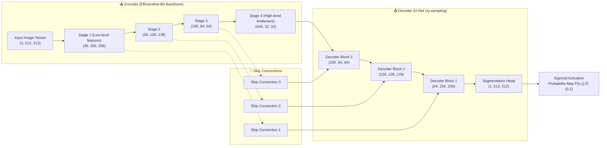
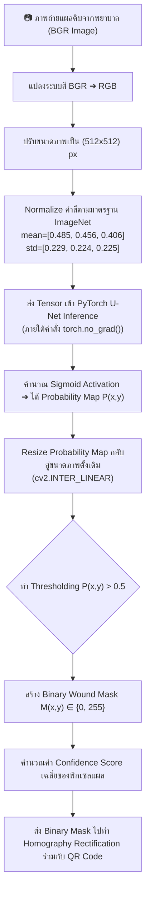
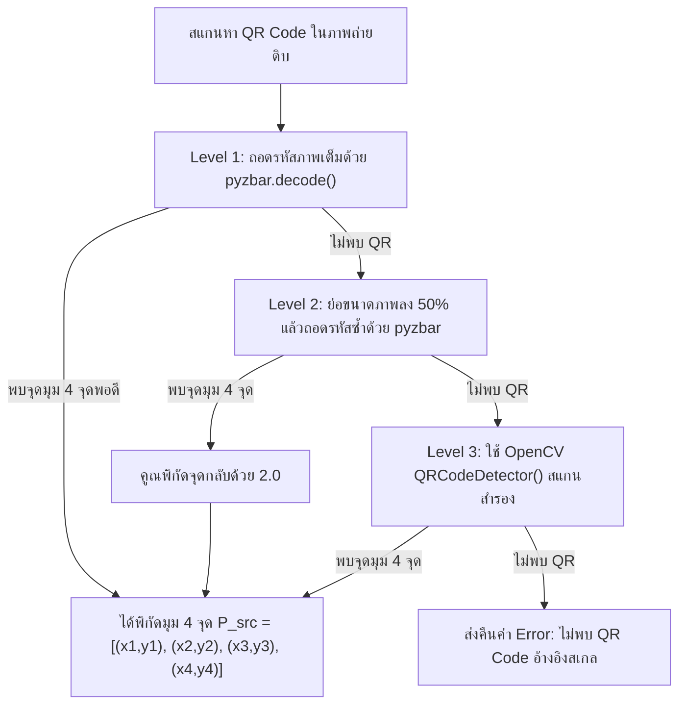

# 🧠 เอกสารข้อกำหนดสถาปัตยกรรมโมเดล AI และเอนจินการวิเคราะห์แผล (AI Deep Learning & Computer Vision Pipeline Specification)

> **โครงการ**: ระบบวิเคราะห์และติดตามขนาดแผลเบาหวานที่เท้าด้วยการเรียนรู้เชิงลึก  
> *(Deep Learning-Based System for Segmentation and Monitoring of Diabetic Foot Ulcers)*  
> **สร้างเมื่อ**: 29 กันยายน 2569 (2026-09-29)  
> **สถานะเอกสาร**: AI Research & Model Architecture Specification  

---

## 📌 สารบัญ (Table of Contents)
1. [ภาพรวมของเอนจินปัญญาประดิษฐ์ (AI Engine Overview)](#1-ภาพรวมของเอนจินปัญญาประดิษฐ์-ai-engine-overview)
2. [สถาปัตยกรรมโครงข่ายประสาท U-Net (EfficientNet-B4)](#2-สถาปัตยกรรมโครงข่ายประสาท-u-net-efficientnet-b4)
3. [ลำดับขั้นตอนท่อประมวลผลข้อมูล AI (AI Data Pipeline Flowchart)](#3-ลำดับขั้นตอนท่อประมวลผลข้อมูล-ai-ai-data-pipeline-flowchart)
4. [ระบบตรวจจับวัตถุอ้างอิงและการดึงระนาบภาพ (QR Detection & Homography Rectification)](#4-ระบบตรวจจับวัตถุอ้างอิงและการดึงระนาบภาพ-qr-detection--homography-rectification)
5. [ฟังก์ชันสูญเสียและตัววัดประเมินผลโมเดล (Loss Functions & Evaluation Metrics)](#5-ฟังก์ชันสูญเสียและตัววัดประเมินผลโมเดล-loss-functions--evaluation-metrics)
6. [การคำนวณพื้นที่แผลจริงทางกายภาพ ($\text{cm}^2$) และความมั่นใจ (Confidence Score)](#6-การคำนวณพื้นที่แผลจริงทางกายภาพ-cm2-และความมั่นใจ-confidence-score)
7. [พื้นที่บันทึกและปรับปรุงข้อมูลโมเดล (Discussion & Future Tuning Notes)](#7-พื้นที่บันทึกและปรับปรุงข้อมูลโมเดล-discussion--future-tuning-notes)

---

## 1. ภาพรวมของเอนจินปัญญาประดิษฐ์ (AI Engine Overview)

เอนจินประมวลผลแผลเบาหวานประกอบด้วย 2 ส่วนทำงานหลักที่ผสานรวมกันอย่างสมบูรณ์:
1. **Computer Vision Calibration Unit (CV Unit)**: ตรวจจับสติกเกอร์ QR Code อ้างอิงขนาด $2.0 \times 2.0\text{ cm}$ และปรับแก้ระนาบมุมกล้องที่เอียงให้อยู่ในมุมมองตรง (Top-Down View) ด้วยสมการ Homography
2. **Deep Learning Segmentation Unit (DL Unit)**: โครงข่ายประสาท U-Net ที่ใช้ **EfficientNet-B4** เป็นโครงข่ายแกนหลัก (Backbone Network / Encoder) ทำหน้าที่จำแนกพิกเซลแผลเบาหวานออกจากผิวหนังปกติ (Semantic Segmentation)

---

## 2. สถาปัตยกรรมโครงข่ายประสาท U-Net (EfficientNet-B4)

โมเดลสร้างจากไลบรารี `segmentation_models_pytorch` โดยใช้โครงสร้างแบบ Encoder-Decoder (U-Net) ร่วมกับ Compound Scaling ของ EfficientNet-B4:

### 2.1 รายละเอียดมิติ Tensors ในแต่ละขั้นตอน

| ชั้นการทำงาน (Layer Stage) | มิติของ Tensor $(C, H, W)$ | คำอธิบายการทำงาน |
| :--- | :--- | :--- |
| **Input Image** | $(3, 512, 512)$ | ภาพถ่ายสี RGB หลังจากการ Resize และ Normalize |
| **Encoder (EfficientNet-B4)** | $(448, 16, 16)$ | สกัดฟีเจอร์เชิงลึกด้วย MBConv (Mobile Inverted Bottleneck Convolution) |
| **Decoder (U-Net Up-sampling)** | $(16, 512, 512)$ | Transpose Convolution รวมกับ Skip Connections จาก Encoder |
| **Segmentation Head** | $(1, 512, 512)$ | Conv 1x1 เพื่อทำความนายคำตอบ (Logits) |
| **Sigmoid Output** | $(1, 512, 512)$ | แปลงค่า Logits เป็นค่าความน่าจะเป็น $P(x,y) \in [0.0, 1.0]$ |

---

## 3. ลำดับขั้นตอนท่อประมวลผลข้อมูล AI (AI Data Pipeline Flowchart)

---

## 4. ระบบตรวจจับวัตถุอ้างอิงและการดึงระนาบภาพ (QR Detection & Homography Rectification)

### 4.1 ระบบตรวจจับ QR Code แบบ 3 ลำดับชั้น (Multi-level Fallback Detection)
เพื่อการตรวจจับสติกเกอร์คิวอาร์โค้ดขนาด $2.0 \times 2.0\text{ cm}$ ที่ทนทานต่อสภาวะแสงและระยะถ่าย:

### 4.2 สมการเมทริกซ์โฮโมกราฟี (Homography Matrix & Boundary Protection)
เมื่อได้จุดพิกัด 4 มุม $\mathbf{P}_{\text{src}} = \{\text{Top-Left}, \text{Top-Right}, \text{Bottom-Right}, \text{Bottom-Left}\}$ และจุดเป้าหมายสเกลคงที่ $\mathbf{P}_{\text{dst}}$ ($1\text{ cm} = 100\text{ px}$):

$$\mathbf{P}_{\text{dst\_ref}} = \begin{bmatrix} 0 & 0 \\ 200 & 0 \\ 200 & 200 \\ 0 & 200 \end{bmatrix}$$

คำนวณเมทริกซ์การแปลงระนาบ $\mathbf{H} \in \mathbb{R}^{3 \times 3}$:

$$\mathbf{H} = \text{cv2.getPerspectiveTransform}(\mathbf{P}_{\text{src}}, \mathbf{P}_{\text{dst\_ref}})$$

เนื่องจากมุมเอียงของกล้องอาจทำให้พิกัดภาพนอกพื้นที่ QR Code ติดลบ (ตกขอบ) ระบบจะคำนวณ Translation Matrix $\mathbf{T}$ เพื่อเลื่อนขอบภาพกลับเข้าเฟรม:

$$\mathbf{T} = \begin{bmatrix} 1 & 0 & -x_{\text{min}} \\ 0 & 1 & -y_{\text{min}} \\ 0 & 0 & 1 \end{bmatrix}, \quad \mathbf{H}_{\text{final}} = \mathbf{T} \cdot \mathbf{H}$$

จากนั้นทำการ Warp ระนาบตรงให้กับทั้งภาพจริงและ Binary Mask:

$$\mathbf{I}_{\text{warped}} = \text{warpPerspective}(\mathbf{I}_{\text{raw}}, \mathbf{H}_{\text{final}}), \quad \mathbf{M}_{\text{warped}} = \text{warpPerspective}(\mathbf{M}_{\text{binary}}, \mathbf{H}_{\text{final}}, \text{flags}=\text{INTER\_NEAREST})$$

---

## 5. ฟังก์ชันสูญเสียและตัววัดประเมินผลโมเดล (Loss Functions & Evaluation Metrics)

ในการฝึกสอนโมเดล (Training Phase) มีการผสานฟังก์ชันสูญเสีย Combo Loss เพื่อจัดการปัญหาความไม่สมดุลของพิกเซลแผลเบาหวาน (Class Imbalance):

### 5.1 Combo Loss (Binary Cross-Entropy + Dice Loss)
$$\mathcal{L}_{\text{Total}} = \mathcal{L}_{\text{BCE}} + \mathcal{L}_{\text{Dice}}$$

1. **Binary Cross-Entropy Loss ($\mathcal{L}_{\text{BCE}}$)**:
   $$\mathcal{L}_{\text{BCE}} = -\frac{1}{N} \sum_{i=1}^{N} \left[ y_i \log(p_i) + (1 - y_i) \log(1 - p_i) \right]$$
2. **Dice Loss ($\mathcal{L}_{\text{Dice}}$)**:
   $$\mathcal{L}_{\text{Dice}} = 1 - \frac{2 \sum_{i=1}^{N} y_i p_i + \epsilon}{\sum_{i=1}^{N} y_i + \sum_{i=1}^{N} p_i + \epsilon} \quad (\text{โดยที่ } \epsilon = 10^{-7})$$

### 5.2 ตัววัดประสิทธิภาพการทำนาย (Evaluation Metrics)
* **Dice Similarity Coefficient (DSC)**:
  $$\text{DSC} = \frac{2 |\mathbf{Y} \cap \hat{\mathbf{Y}}|}{|\mathbf{Y}| + |\hat{\mathbf{Y}}|}$$
* **Intersection over Union (IoU / Jaccard Index)**:
  $$\text{IoU} = \frac{|\mathbf{Y} \cap \hat{\mathbf{Y}}|}{|\mathbf{Y} \cup \hat{\mathbf{Y}}|} = \frac{\text{DSC}}{2 - \text{DSC}}$$

### 5.3 ผลการทดลองฝึกสอนจริง (Empirical Training & Validation Results)
ข้อมูลจริงที่ได้จากการฝึกสอนโมเดลบน Kaggle (`sarayutsupsin/foot-ulcer-segmentation-dataset`):

* **ที่มาและจำนวนข้อมูล (Benchmark Dataset Distribution)**:
  * **ชื่อชุดข้อมูล**: **FUSeg (Foot Ulcer Segmentation Challenge 2021 / MICCAI 2021)**
  * **หน่วยงานผู้จัดทำ**: **University of Wisconsin-Milwaukee (UWM)** ร่วมกับ **AZH Wound and Vascular Center** (C. Wang et al.)
  * **ภาพถ่ายรวมทั้งสิ้น**: 1,210 ภาพจากผู้ป่วยจริง 889 ราย (การทำ Mask โดยแพทย์ผู้เชี่ยวชาญประสบการณ์ 20 ปี)
  * **Train Set**: 810 ภาพ (66.94%)
  * **Validation Set**: 200 ภาพ (16.53%)
  * **Test Set**: 200 ภาพ (16.53%)
* **การตั้งค่า Hyperparameters**:
  * **Backbone**: EfficientNet-B4 (`weights='imagenet'`)
  * **Input Dimension**: $512 \times 512 \times 3$
  * **Batch Size**: 8
  * **Epochs**: 50 Epochs
  * **Optimizer**: AdamW ($\text{lr} = 3 \times 10^{-4}$, $\text{weight\_decay} = 10^{-4}$)
  * **Scheduler**: CosineAnnealingLR ($T_{\text{max}} = 50$, $\eta_{\text{min}} = 10^{-6}$)
  * **Data Augmentation**: Horizontal/Vertical Flip, RandomRotate90, ShiftScaleRotate, RandomBrightnessContrast, HueSaturationValue, GaussNoise

#### 🏆 สรุปผลการวัดทดสอบโมเดลสูงสุด (Best Validation Metrics)
* **Best Validation Dice Score (DSC)**: **`0.8582` (85.82%)** (บรรลุใน Epoch ที่ 42)
* **Best Validation IoU Score**: **`0.7882` (78.82%)**
* **Best Validation Loss (BCE + Dice)**: **`0.1547`**

| Epoch | Train Loss | Val Loss | Train IoU | Val IoU | Train Dice | Val Dice | หมายเหตุ |
| :---: | :---: | :---: | :---: | :---: | :---: | :---: | :---: |
| **01** | 1.4579 | 1.1866 | 0.2616 | 0.5750 | 0.3444 | 0.6913 | เริ่มต้นฝึกสอน |
| **05** | 0.3992 | 0.3242 | 0.6749 | 0.7417 | 0.7733 | 0.8243 | โมเดลเริ่มเรียนรู้ขอบแผล |
| **10** | 0.2075 | 0.1984 | 0.7393 | 0.7504 | 0.8258 | 0.8344 | - |
| **20** | 0.1585 | 0.1628 | 0.7846 | 0.7803 | 0.8589 | 0.8519 | - |
| **32** | 0.1445 | 0.1579 | 0.7984 | 0.7854 | 0.8700 | 0.8558 | บันทึกเช็คพอยต์ |
| **42** | **0.1324** | **0.1547** | **0.8137** | **0.7882** | **0.8815** | **0.8582** | 🏆 **Best Saved Model** |
| **50** | 0.1372 | 0.1569 | 0.8087 | 0.7863 | 0.8766 | 0.8562 | สิ้นสุด 50 Epochs |

---

## 6. การคำนวณพื้นที่แผลจริงทางกายภาพ ($\text{cm}^2$) และความมั่นใจ (Confidence Score)

### 6.1 สูตรคำนวณพื้นที่แผล ($\text{cm}^2$)
เมื่อภาพ Binary Mask ถูกปรับให้อยู่ในระนาบตรงด้วยอัตราส่วนคงที่ $S = 100\text{ px/cm}$ (หรือ 1 พิกเซล $= 0.01\text{ cm} \times 0.01\text{ cm} = 0.0001\text{ cm}^2$):

$$\text{Area}_{\text{cm}^2} = \frac{\sum_{(x,y)} M_{\text{warped}}(x,y) > 0}{S^2} = \frac{N_{\text{wound\_pixels}}}{10,000} \quad [\text{cm}^2]$$

### 6.2 การคำนวณค่าความมั่นใจของโมเดล (Confidence Score)
คำนวณจากค่าเฉลี่ยของความน่าจะเป็น (Probability) เฉพาะพิกเซลที่ถูกทำนายว่าเป็นบาดแผล ($P(x,y) > \tau$):

$$\text{Confidence Score} = \frac{1}{N_{\text{wound}}} \sum_{(x,y) \in \text{Wound}} P(x,y)$$

---

## 7. พื้นที่บันทึกและปรับปรุงข้อมูลโมเดล (Discussion & Future Tuning Notes)

> *ส่วนนี้ใช้สำหรับบันทึกผลการทดสอบ ประสิทธิภาพโมเดล และข้อเสนอแนะในการปรับแต่งเพิ่มเติม*

* **[2026-09-29]**: สกัดข้อมูลการเทรนจริงจากไฟล์ Kaggle Notebook (`Foot Ulcer Segmentation V.3`):
  - บันทึกค่า **Best Val Dice = 85.82%**, **Best Val IoU = 78.82%** และ **Best Val Loss = 0.1547**
  - บันทึกชุดข้อมูล 1,010 รูป (Train 810 / Val 200) และกระบวนการ Data Augmentation ด้วย Albumentations
* **[การทดลองเพิ่มเติมในโน้ตบุ๊ก]**: มีการทดสอบการใช้งาน **Focal Tversky Loss** (`alpha=0.7, beta=0.3, gamma=0.75`) เพื่อแก้ปัญหา Class Imbalance ในกรณีแผลขนาดเล็กมาก

---

