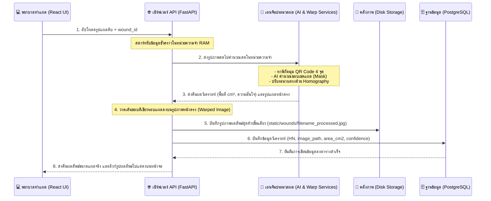

# 🩺 คู่มือเชิงทฤษฎี: ระบบวิเคราะห์และคำนวณขนาดแผลเบาหวาน (Wound Calculation Guide)

คู่มือฉบับนี้อธิบายทฤษฎีทางคณิตศาสตร์, อัลกอริทึมของโมเดลปัญญาประดิษฐ์ (AI), และขั้นตอนการชดเชยมุมกล้องเอียง เพื่อใช้เป็นข้อมูลอ้างอิงทางวิชาการและประกอบเล่มรายงานการสอบโครงงานปี 4 ของคุณครับ

---

## 📌 บทที่ 1: ปัญหาทางกายภาพในการถ่ายภาพแผลเบาหวาน (Clinical & Physical Challenges)

เมื่อแพทย์หรือพยาบาลถ่ายภาพแผลเบาหวาน (Diabetic Foot Ulcer - DFU) ด้วยกล้องโทรศัพท์มือถือ จะพบข้อผิดพลาดทางกายภาพ 3 ประการหลักที่ทำให้ตัวเลขการวัดขนาดพื้นที่แผลผิดเพี้ยน:

1.  **ระยะทางถ่ายภาพไม่คงที่ (Distance Scaling Error)**: 
    *   การถ่ายรูปจากระยะใกล้จะทำให้แผลดูให�### 2.1 อธิบายแบบง่าย: การหาพื้นที่สติกเกอร์ด้วยสูตรเชือกผูกรองเท้า (Shoelace Formula)
*   **เปรียบเทียบให้เห็นภาพ**: 
    *   จินตนาการเหมือนเราปักหมุด 4 ตัวไว้ที่มุมของสติกเกอร์ QR Code บนภาพ แล้วเอาเชือกเส้นหนึ่งมา **"ผูกไขว้โยงมัดเข้าหากันเป็นรูปเชือกผูกรองเท้า"** เพื่อวัดพื้นที่ของรูปทรงแผ่นสติกเกอร์ 
    *   ข้อดีคือ ต่อให้คนไข้จะแปะสติกเกอร์เอียงซ้าย เอียงขวา หรือเอียงกี่องศาก็ตาม เชือกตัวนี้ก็ยังมัดพื้นที่จริงได้เท่าเดิมเสมอ 
    *   ทำให้เราคำนวณพื้นที่พิกเซลของ QR Code ได้โดยที่ **ตัวเลขไม่เกิดการบวมหรือเพี้ยน** แตกต่างจากการวัดความกว้างคูณความสูงตรง ๆ ที่จะเกิดค่าลวงเมื่อสติกเกอร์เอียงเฉียงครับ
*   **คำสั่งในโค้ด**: เรียกใช้ `cv2.contourArea(pts)` มารันสูตรคูณไขว้เชือกผูกรองเท้านี้ให้อัตโนมัติ

---

### 2.2 อธิบายแบบง่าย: การชดเชยมุมเอียงกล้องด้วย Homography
*   **เปรียบเทียบให้เห็นภาพ**: 
    *   จินตนาการว่าภาพแผลเอียง ๆ ที่พยาบาลถือถ่ายเฉียงจากมุมบน คือ **"แผ่นยางรูปสี่เหลี่ยมเบี้ยว ๆ"** 
    *   การทำ Homography คือการที่ระบบหยิบมุมแผ่นยางทั้ง 4 จุดมา **"ออกแรงยืดดึงมุมดึงขอบออก"** ให้ตึงเป๊ะ กลายเป็นสี่เหลี่ยมจัตุรัสหน้าตรงขนาด **200x200 พิกเซล** 90 องศาตั้งฉากพอดี
    *   เมื่อตัวสติกเกอร์ถูกยืดดึงให้ตรงแล้ว พื้นที่รอบข้างทั้งหมดรวมถึง **แผลของคนไข้** ก็จะถูกยืดระนาบให้ตรงสวยงามขนานแนวสายตาไปด้วย ทำให้รูปร่างแผลไม่หดแคบเหมือนตอนถ่ายเฉียงเฉียงครับ

#### 🎯 กติกามาตราส่วนเป้าหมาย (Scale Rules)
*   เราตั้งกติกาให้ **"ความยาว 1 เซนติเมตรจริง เท่ากับ 100 พิกเซลในรูปภาพหน้าตรง"** (100 px/cm)
*   ตัวสติกเกอร์ QR Code ของเรามีขนาดจริง 2.0x2.0 cm ปลายทางหลังยืดหน้าตรงจึงต้องเท่ากับ **200x200 พิกเซล** คงที่เสมอ
*   **การแก้ปัญหาขอบภาพแหว่ง (Translation)**: เมื่อเราออกแรงบิดภาพตรงแล้ว ขอบภาพอาจเยื้องตกไปในโซนพิกัดติดลบจนแผลหลุดขอบหายไป เราจึงเพิ่มสมการเลื่อน Translation Matrix เพื่อดึงย้ายรูปทั้งหมดกลับเข้ามาในกรอบจอภาพฝั่งบวกให้แผลกลับมาโชว์ครบถ้วนครับ

---

### 2.3 สูตรคำนวณพื้นที่แผลจริง (Wound Area Formulas)

เมื่อปรับระนาบแผ่นยางเอียงให้ตึงตรงแล้ว การคำนวณพื้นที่จริงในโลกกายภาพจะง่ายขึ้นมากด้วยสูตร 2 ขั้นตอน:

#### ขั้นที่ 1: หามาตราส่วนพิกเซล (Scale Factor)
$$\text{Scale Factor} = \frac{\text{พื้นที่จริงของสติกเกอร์ } (4.0\text{ cm}^2)}{\text{พื้นที่พิกเซลของสติกเกอร์ระนาบตรง } (200 \times 200 = 40,000\text{ px})}$$

$$\text{Scale Factor} = \frac{4.0}{40,000} = \mathbf{0.0001\text{ cm}^2/\text{pixel}}$$
*(หมายความว่า 1 พิกเซลสีขาวในภาพตรง จะมีพื้นที่จริงในโลกจริงเท่ากับ 0.0001 ตารางเซนติเมตรเสมอ)*

#### ขั้นที่ 2: แปลงพิกเซลแผลเป็นขนาดจริง
$$\text{พื้นที่แผลจริง } (cm^2) = \text{จำนวนพิกเซลแผลสีขาวบนภาพตรง} \times 0.0001$$

---

## 📌 บทที่ 3: ระบบปัญญาประดิษฐ์และการวิเคราะห์ขอบแผล (AI Model & Boundary Analysis)

### 3.1 อธิบายแบบง่าย: การทำงานของ U-Net และสะพานเชื่อมพิกัด (Skip Connections)
*   **การย่อและขยายภาพ (Encoder/Decoder)**: ฝั่งซ้ายจะทำหน้าที่บีบรูปภาพแผลเพื่อวิเคราะห์ประเภทเนื้อเยื่อ (แผลแดงช้ำหรือแผลเน่าแห้ง) ส่วนฝั่งขวาจะขยายขนาดภาพกลับขึ้นมาเพื่อชี้ตำแหน่งพิกเซลแผล
*   **สะพานเชื่อมพิกัด (Skip Connections) คืออะไร?**: 
    *   เปรียบเหมือนตอนที่ AI ย่อยรูปภาพไปเพื่อวิเคราะห์ มันจะทำให้รายละเอียดพิกัดขอบคม ๆ หลุดหายไป (ภาพแผลเบลอ) 
    *   เราจึงสร้าง **"สะพานดึงข้อมูลขอบคม ๆ"** ยิงข้ามจากฝั่งซ้ายของตัว U ส่งข้ามมาประประกบฝั่งขวาตรง ๆ เพื่อให้ AI วาดภาพขอบแผลสุดท้ายออกมาได้คมกริบ ไม่บวมแหว่งหรือเบลอจนเพี้ยนครับ

---

### 3.2 อธิบายแบบง่าย: การเช็คความลังเลขอบแผล (Shannon Entropy)
*   **ปัญหาจริง**: ในทางการแพทย์ แผลเบาหวานจะไม่กลมตึงเหมือนขอบสติกเกอร์ แต่จะมีขอบเขตที่ก้ำกึ่ง เช่น ผิวสีแดงช้ำอักเสบรอบ ๆ (Erythema) หรือสะเก็ดแห้งเบลอ ๆ หากเราตัดเกณฑ์พิกเซลด้วยระดับ 0.5 ขาดเพียงอย่างเดียว เราจะมองไม่เห็นคุณภาพเนื้อเยื่อรอบนอกเลย
*   **ทางแก้ด้วย Shannon Entropy**:
    *   เป็นการเข้าไปถาม AI ทีละพิกเซลว่า *"พิกเซลนี้เป็นแผลไหม?"*
    *   **พิกเซลตรงกลางแผลแดงก่ำ**: AI จะมั่นใจ 100% ว่าแผลชัวร์! **(เอนโทรปี = 0.0, ไม่ลังเล)**
    *   **พิกเซลผิวหนังปกติ**: AI จะมั่นใจ 100% ว่าไม่ใช่แผลชัวร์! **(เอนโทรปี = 0.0, ไม่ลังเล)**
    *   **พิกเซลตรงขอบแผลเปื่อยเรื่อ ๆ**: AI จะลังเลมาก ตอบแบบ 50/50 **(เอนโทรปี = 1.0, ลังเลสูงสุด)**
*   **มีประโยชน์ทางการแพทย์อย่างไร?**: 
    *   **ระบบแจ้งเตือนการอักเสบล่วงหน้า (Early Warning)**: หากพยาบาลตรวจคนไข้แล้วพบว่า ขนาดพื้นที่แผลตารางเซนติเมตรอาจจะดูเท่าเดิม แต่ค่าเฉลี่ยเอนโทรปีความลังเลกลับเพิ่มตัวสูงขึ้น บ่งบอกว่าผิวรอบนอกของแผลเริ่มแดงอักเสบลุกลามเปื่อยยุ่ยมากขึ้น ช่วยสะกิดเตือนแพทย์ให้รีบปรับยาหรือสลับแนวทางการรักษาได้ทันท่วงทีก่อนแผลลุกลามใหญ่ขึ้นครับ

#### 🛠️ ตัวช่วยวิศวกรรมป้องกันโค้ดแครชดับ (Numerical Stability Epsilon)
ในทางคอมพิวเตอร์ เราไม่สามารถคำนวณหาค่า Log ของตัวเลข 0 ได้ คอมพิวเตอร์จะแครชและสั่งปิดแอป API ไปทันที 
เพื่อแก้บั๊กนี้ เราจึงบวกค่าคงที่จิ๋ว Epsilon ($\epsilon = 10^{-7}$ หรือ 0.0000001) เข้าไปเสริมความคงเส้นคงวาให้สมการ:
```python
eps = 1e-7
entropy = - (p * np.log2(p + eps) + (1 - p) * np.log2(1 - p + eps))
```
ช่วยให้ระบบรันวิเคราะห์แผลคนไข้ได้ต่อเนื่องโดยไม่แครชล่มเวลารันงานจริงครับmes 3$:

$$\begin{bmatrix} x' \\ y' \\ 1 \end{bmatrix} \sim H \begin{bmatrix} x \\ y \\ 1 \end{bmatrix} = \begin{bmatrix} h_{11} & h_{12} & h_{13} \\ h_{21} & h_{22} & h_{23} \\ h_{31} & h_{32} & h_{33} \end{bmatrix} \begin{bmatrix} x \\ y \\ 1 \end{bmatrix}$$

*   **กระบวนการหาระนาบลึก**: สัมประสิทธิ์พิกัดราบและดิ่งใหม่จะถูกหารเฉลี่ยด้วยอัตราส่วนระยะห่าง (Depth factor $h_{31}x + h_{32}y + h_{33}$) 
*   **ผลลัพธ์**: ส่วนของภาพที่อยู่ไกลสายตา (ซึ่งดูเล็กเกินจริง) จะถูกยืดขยายสัดส่วนให้ออกมาเท่าเทียมกันทั้งระนาบ เสมือนเราก้มลงไปตั้งกล้องถ่ายมุมฉาก 90 องศาเป๊ะ ๆ

#### 🎯 กติกามาตราส่วนเป้าหมาย (Scale Rules)
*   เรากำหนดมาตราส่วนอ้างอิงให้ **"ระยะ 1 เซนติเมตรจริง เท่ากับ 100 พิกเซลในภาพระนาบตรง"** (100 px/cm)
*   ดังนั้น QR Code ขนาดจริง 2x2 cm จึงต้องถูก Warp ปลายทางให้มีขนาดพิกัดตรงคงที่ที่ **200x200 พิกเซล** เสมอ
*   การป้องกันภาพแหว่งจากการเยื้องพิกัดติดลบ (Warp Offset) แก้ไขโดยการเลื่อน Translation Matrix ชดเชยจุดมุมที่ติดลบให้ขยับกลับเข้ามาในเฟรมบวกทั้งหมด

---

### 2.3 สูตรคำนวณพื้นที่แผลจริง (Wound Area Formulas)

เมื่อดึงภาพและมาส์กแผลให้อยู่ในระนาบตรงหน้าขนานมาตรฐานแล้ว การคำนวณพื้นที่จริงจะใช้สูตรคูณไขว้ 2 ขั้นตอนดังนี้ครับ:

#### ขั้นตอนที่ 1: คำนวณอัตราส่วนมาตราส่วนคงที่ (Scale Factor)
$$\text{Scale Factor} = \frac{\text{พื้นที่จริงของสติกเกอร์อ้างอิง } (4.0\text{ cm}^2)}{\text{พื้นที่พิกเซลเป้าหมายของสติกเกอร์ } (200 \times 200 = 40,000\text{ px})}$$

$$\text{Scale Factor} = \frac{4.0}{40,000} = \mathbf{0.0001\text{ cm}^2/\text{pixel}}$$

#### ขั้นตอนที่ 2: คำนวณขนาดพื้นที่จริงของแผลเบาหวาน
$$\text{พื้นที่แผลจริง } (cm^2) = \text{จำนวนพิกเซลสีขาวของแผลบนภาพหน้าตรง} \times 0.0001$$

---

## 📌 บทที่ 3: ระบบปัญญาประดิษฐ์และการวิเคราะห์ขอบแผล (AI Model & Boundary Analysis)

### 3.1 สถาปัตยกรรมแบ่งส่วนภาพแผลเบาหวาน (U-Net with EfficientNet-B4)
*   **Encoder (EfficientNet-B4)**: ทำหน้าที่ย่อยขนาดรูปภาพเพื่อจับลักษณะเด่นทางการแพทย์ เช่น สีผิวอักเสบ เนื้อเยื่อสีช้ำแดง
*   **Decoder**: ทำหน้าที่ขยายความละเอียดของภาพกลับขึ้นมาเพื่อทำนายผลลัพธ์เป็นจุดพิกเซลแผล
*   **Skip Connections**: คอยเชื่อมต่อพิกัดขอบเขตแผลที่มีความละเอียดสูงจาก Encoder วิ่งไปประกบ Decoder ป้องกันปัญหาภาพผลลัพธ์ AI บวมหรือแหว่งขอบ
*   **Bilinear Interpolation**: ใช้ขยายและเกลี่ยขนาด Probability Map คืนขนาดดั้งเดิมเพื่อความเรียบเนียนของขอบก่อนตัดเกณฑ์ที่ระดับ 0.5 (ความมั่นใจ 50% ขึ้นไปถือว่าเป็นแผล)

---

### 3.2 ความลังเลขอบแผลเบาหวานและการประยุกต์ใช้ Shannon Entropy
ผิวหนังของคนไข้โรคเบาหวานบริเวณรอยต่อรอบขอบแผลจะไม่มีเส้นแบ่งแบบขาวดำตัดขาดชัดเจน แต่มักมีแนวผิวหนังเปื่อยยุ่ย (Maceration) หรือเนื้อระเรื่ออักเสบ (Erythema) คลุมเฉดอยู่

ระบบจึงนำหลักการทฤษฎีสารสนเทศ **Shannon Entropy (เอนโทรปีของแชนนอน)** มาวัดความก้ำกึ่งลังเลของขอบแผลที่ระดับพิกเซล:

$$H(X) = - \sum_{i} P(x_i) \log_2 P(x_i)$$

*   **เอนโทรปีเฉลี่ยต่ำ (ใกล้ 0.0)**: AI มั่นใจเด็ดขาด (เช่น พิกเซลนี้เป็นใจกลางก้นแผลแดงสดชัวร์ หรือ ผิวสุขภาพดีแน่ ๆ)
*   **เอนโทรปีเฉลี่ยสูง (ใกล้ 1.0)**: AI เกิดความลังเลก้ำกึ่ง (เช่น บริเวณขอบแผลเบลออักเสบเรื่อ ๆ)

#### 🛠️ การป้องกันสูตรคณิตศาสตร์แครช (Numerical Stability Check)
ในทางโปรแกรมมิ่ง หากระดับความน่าจะเป็นของพิกเซลมีค่าเท่ากับ 0.0 หรือ 1.0 เป๊ะ ๆ สูตรคำนวณทางคณิตศาสตร์จะเกิดความผิดพลาดเนื่องจากไม่สามารถหาค่าล็อกการิทึมฐานสองของ 0 ได้ ($\log_2 0 = \text{Undefined}$) ส่งผลให้ตัวเว็บ API แครชล่มทันที

เราจึงนำค่าคงที่ขนาดเล็กระดับอะตอม **Epsilon ($\epsilon = 10^{-7}$)** เข้าไปบวกเสริมความคงเส้นคงวาให้โปรแกรมทำงานต่อไปได้โดยไม่ล่ม:

```python
eps = 1e-7
entropy = - (p * np.log2(p + eps) + (1 - p) * np.log2(1 - p + eps))
```
กลไกจิ๋วตัวนี้ช่วยให้การสแกนแผลทำได้ไหลลื่นและรับประกันเสถียรภาพการประยุกต์งานวิจัยทางการแพทย์ในโลกความจริงได้อย่างยอดเยี่ยมครับ

---

## 📌 บทที่ 4: สถาปัตยกรรมการไหลของข้อมูลและโครงสร้างโฟลเดอร์ (System Architecture & Folder Design)

เพื่อให้แอปพลิเคชันหน้าบ้าน (React) และหลังบ้าน (FastAPI) สื่อสารกันได้อย่างมีประสิทธิภาพโดยไม่มีการสร้างขยะรูปภาพหรือเก็บตัวแปรดีบักส่วนเกินลงบนฮาร์ดดิสก์ เราได้ออกแบบกระบวนการไหลของข้อมูลระดับภาพรวม (High-Level Data Flow) ดังภาพสัญญะด้านล่างนี้:



### 📂 ผังการปรับปรุงโฟลเดอร์ของโครงการหลัก
เราสถาปนาโฟลเดอร์ใหม่ขึ้นมารองรับระบบบริการ AI และการให้บริการไฟล์ภาพนิ่งดังนี้:

```text
D:\University memory\year4 [2569]\project_ICT\y4\Deep_Learning-Based_System_for_Segmentation_and_Monitoring_of_Diabetic/
├── server/
│   ├── weights/                      # [NEW] โฟลเดอร์เก็บไฟล์น้ำหนัก AI (model.pth)
│   │
│   ├── app/
│   │   ├── services/                 # [NEW] โฟลเดอร์เก็บโค้ดประมวลผลแยกอิสระ (OOP)
│   │   │   ├── __init__.py           # บัญชีอิมพอร์ตบริการภายใน
│   │   │   ├── qr_detector.py        # คำสั่งสแกน QR Code ด้วย pyzbar
│   │   │   ├── wound_segmenter.py    # คำสั่งสร้างโมเดล U-Net & Predict แผลเบาหวาน
│   │   │   └── image_rectifier.py    # คำสั่ง Homography Warp แก้ไขระนาบภาพเอียง
│   │   │
│   │   └── static/                   # [NEW] โฟลเดอร์บริการรูปภาพนิ่ง
│   │       └── wounds/               # เก็บภาพถ่ายแผลที่ประมวลผลเสร็จแล้วสำหรับเปิดดูบนหน้าเว็บ
```

---

## 📌 บทที่ 5: แนวทางการปรับแต่งโค้ดแต่ละไฟล์ในโครงการ (File Modification Spec)

ในการเอาตรรกะประมวลผลแผลจากห้องทดลองเข้ามาติดตั้งในโค้ดระบบจริง เราทำการปรับจูนไฟล์โปรแกรมหลัก 3 จุด ดังนี้ครับ:

### ⚙️ 5.1 ไฟล์: `server/app/core/config.py` (เพิ่มพารามิเตอร์คงที่ของเอนจิน)
*   **จุดที่ปรับปรุง**: เขียนเพิ่มค่าตัวแปรคงที่ (Constants) สำหรับควบคุมการคำนวณแผล และขีดจำกัดขนาดภาพเอียงเฉียงเพื่อความปลอดภัย
*   **โค้ดที่จะเพิ่ม**:
    ```python
    MODEL_PATH = "weights/model.pth"
    STATIC_DIR = "static/wounds"
    QR_SIZE_CM = 2.0
    TARGET_PX_PER_CM = 100.0   # 1 cm = 100 px (สเกลมาตรฐานหลังการดึงระนาบตรง)
    MAX_WARPED_DIM = 5000      # พิกเซลกว้างสูงสุดป้องกันการบิดเบี้ยวจนภาพหลุดเฟรม
    THRESHOLD = 0.5            # ระดับคัดขอบแผลปัญญาประดิษฐ์
    ```

### ⚙️ 5.2 ไฟล์: `server/main.py` (เปิดให้บริการ Static File Serving)
*   **จุดที่ปรับปรุง**: อิมพอร์ต `StaticFiles` ของ FastAPI เพื่อทำการเมานต์แชร์โฟลเดอร์ภาพถ่ายผลลัพธ์ให้แอปภายนอก (React หน้าบ้าน) สามารถยิงคำขอ HTTP ชี้ URL เข้ามาดูรูปภาพได้โดยตรง
*   **โค้ดที่จะปรับปรุง**:
    ```python
    from fastapi.staticfiles import StaticFiles
    # ... สถาปนาเซิร์ฟเวอร์หลังเปิดระบบ ...
    app.mount("/static", StaticFiles(directory="static"), name="static")
    ```

### ⚙️ 5.3 ไฟล์: `server/app/routers/wounds.py` (สร้างเราเตอร์ API รับส่งสแกนภาพจริง)
*   **จุดที่ปรับปรุง**: สร้าง Endpoint เมธอด `POST /records` เพื่อรองรับการยิงอัปโหลดรูปภาพแผลจากพยาบาลทำแผล โดยกระบวนการภายในจะทำงานประสานดังนี้:
    1.  รับรูปภาพแบบ `UploadFile` เข้ามาในหน่วยความจำแรม
    2.  ส่งรูปภาพไปให้ `detect_qr()` ในโมดูลบริการ ตรวจเช็คว่ามีสติกเกอร์ครบ 4 มุมหรือไม่ (หากไม่ครบระบบจะตีกลับส่ง HTTP 400 เพื่อป้องกันข้อมูลเสียหาย)
    3.  ส่งรันโมเดล AI ผ่าน `segment_wound()` เพื่อหาขอบแผลดิบในแรม
    4.  สั่งบิดระนาบตรงชดเชยกล้องเอียงผ่าน `warp_image_and_mask()`
    5.  คำนวณหาพื้นที่จริงจากมาตราส่วนคงที่ $0.0001 \times \text{พิกเซลขาวระนาบตรง}$
    6.  วาดกรอบเส้นสีเขียวรอบข
    อบแผลจริงบนภาพระนาบตรง แล้วสั่งเขียนบันทึกไฟล์ลงดิสก์พิกัดเดียวคือ `static/wounds/filename_processed.jpg`
    7.  เขียนบันทึกสรุปข้อมูลทั้งหมดบันทึกลงดาต้าเบส PostgreSQL ในตาราง `wound_records` แล้วส่งข้อมูลตอบกลับแอปหน้าบ้านทันที

