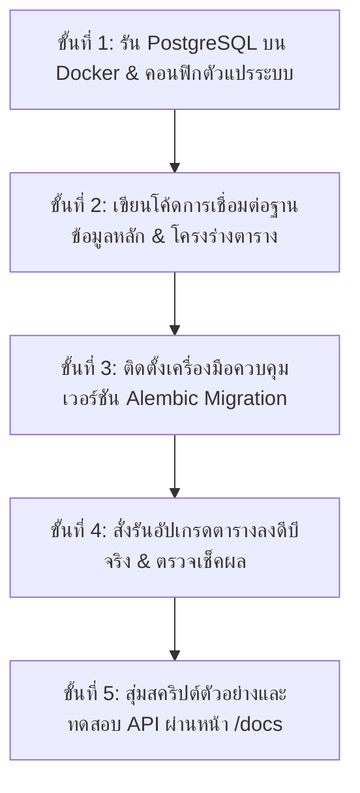

# คู่มือการเตรียมฐานข้อมูลและโครงสร้างระบบหลังบ้าน (Feature-Based Modular + Alembic Migration)

เอกสารฉบับนี้สรุปโครงสร้างของระบบหลังบ้าน (Backend) สำหรับโครงการ **ระบบวิเคราะห์และติดตามขนาดแผลเบาหวานที่เท้าด้วยการเรียนรู้เชิงลึก (Diabetic Foot Ulcer System)** โดยออกแบบมาให้มีระบบควบคุมเวอร์ชันฐานข้อมูล (Alembic Migration) เพื่อรองรับการปรับเปลี่ยนตารางระหว่างพัฒนาโดยข้อมูลไม่สูญหาย

---

## 📂 1. โครงสร้างโฟลเดอร์ของระบบหลังบ้าน (Directory Structure)

เราจัดกลุ่มระบบหลังบ้านภายใต้โฟลเดอร์ `server/` ดังนี้:

```text
server/
├── Dockerfile                  # ไฟล์สร้าง Docker Image ของ Backend
├── requirements.txt            # ไฟล์รวม Dependencies ของ Python (FastAPI, SQLAlchemy, Alembic, OpenCV)
├── weights/                    # โฟลเดอร์สำหรับเก็บน้ำหนักโมเดล Deep Learning (เช่น model.pth)
│
│── 📌 [โฟลเดอร์และไฟล์ควบคุมเวอร์ชันฐานข้อมูล - Alembic Migration]
├── alembic.ini                 # คอนฟิกหลักของ Alembic (ตั้งค่าการเชื่อมดีบีแอบอ่านค่าจาก .env)
├── alembic/
│   ├── env.py                  # สคริปต์รัน Migration (ตั้งค่าตรวจหา Metadata และ .env)
│   ├── script.py.mako          # เทมเพลตสำหรับสร้าง Revision ไฟล์
│   └── versions/               # โฟลเดอร์ประวัติการบันทึกเวอร์ชันฐานข้อมูล (.py)
│
└── app/
    ├── main.py                 # จุดเริ่มต้น of FastAPI และจุดทดสอบ API เชื่อมต่อดีบี
    │
    ├── core/                   # ส่วนงานแกนหลักที่ใช้ร่วมกันในระบบ (Shared Core)
    │   ├── config.py           # โหลดและจัดการการตั้งค่าแอปพลิเคชัน (.env)
    │   └── security.py         # การเข้ารหัสรหัสผ่าน (Hashing) และจัดการ Access Token (JWT)
    │
    ├── db/                     # ระบบจัดการการเชื่อมต่อฐานข้อมูลหลัก (Shared DB Connection)
    │   ├── base_class.py       # สร้าง Base Class สำหรับทำ Declarative Base
    │   ├── session.py          # สร้าง DB Engine และสร้าง SessionLocal สำหรับดึงข้อมูล
    │   └── seed.py             # สคริปต์กรอกข้อมูลตั้งต้นระบบ (Roles และตำแหน่งร่างกาย)
    │
    └── models/                 # 🗄️ [ตารางฐานข้อมูลแยกย่อยรายตาราง ป้องกันการ Import วนรอบ]
        ├── __init__.py         # สารบัญหลัก นำเข้าโมเดลย่อยทั้งหมดมารวมศูนย์เพื่อให้ Alembic ตรวจพบ
        ├── role.py             # ตารางบทบาทสิทธิ์ (roles)
        ├── user.py             # ตารางบัญชีผู้ใช้งาน (users)
        ├── nurse.py            # ตารางประวัติพยาบาล (nurse)
        ├── patient.py          # ตารางประวัติคนไข้ (patients)
        ├── body_part.py        # ตารางตำแหน่งอวัยวะแผล (body_parts)
        ├── wound.py            # ตารางจุดเกิดแผลหลัก (wounds)
        ├── wound_record.py     # บันทึกประวัติวิเคราะห์แผลรายครั้ง (wound_records)
        └── appointment.py      # ตารางนัดหมายติดตามผล (appointments)
```

---

## 📋 2. รายการตารางฐานข้อมูลหลัก (ในแพ็กเกจ `app/models/`)

ตารางทั้งหมดถูกแยกออกเป็น 1 ตารางต่อ 1 ไฟล์ ภายใต้โฟลเดอร์ `server/app/models/` ประกอบไปด้วย 8 ตารางหลัก:
1. **`roles`** (`role.py`): สิทธิ์การใช้งาน (`role_id` [PK], `role_name`)
2. **`users`** (`user.py`): บัญชีผู้ใช้ล็อกอินหลัก (`user_id` [PK], `username`, `password`, `role_id` [FK])
3. **`nurse`** (`nurse.py`): ประวัติส่วนตัวพยาบาลผู้รับผิดชอบสแกนแผล (`user_id` [PK, FK])
4. **`patients`** (`patient.py`): เวชระเบียนคนไข้เบาหวาน (`HN` [PK], `user_id` [FK])
5. **`body_parts`** (`body_part.py`): ตำแหน่งอวัยวะแผล เช่น หน้าเท้า, ฝ่าเท้า, ส้นเท้า (`body_part_id` [PK], `body_part_name`)
6. **`wounds`** (`wound.py`): ตารางจัดกลุ่มแผลเป็นจุดๆ เพื่อพล็อตกราฟแยกจุดแผลได้ถูกต้อง (`wound_id` [PK], `HN` [FK], `body_part_id` [FK], `side` ข้างเท้าซ้าย/ขวา)
7. **`wound_records`** (`wound_record.py`): ผลงาน Deep Learning วิเคราะห์พื้นที่แผลรายครั้งเพื่อวาดกราฟเส้นติดตามผล (`record_id` [PK], `wound_id` [FK], `image_path`, `area_pixel` [AI], `area_cm2` [OpenCV QR Scale])
8. **`appointments`** (`appointment.py`): ปฏิทินวันและเวลานัดสแกนติดตามแผลรอบถัดไป (`appointment_id` [PK], `HN` [FK], `nurse_user_id` [FK])

---

## 🐳 3. การตั้งค่าระบบสิ่งแวดล้อมเสมือนและการแยกพอร์ตเครือข่าย (Docker & Env Setup)

เพื่อให้โครงการ DFU รันได้อย่างปลอดภัยในเครื่องและง่ายต่อการโยกย้ายระบบ เราทำสิ่งแวดล้อมผ่านระบบ Docker ดังนี้:

### 3.1 การแยกสายต่อดีบี DATABASE_URL และ DATABASE_URL_DOCKER
เนื่องจากแอปของเราจะทำงานอยู่บน 2 วงแลนเครือข่ายที่ตัดขาดจากกัน (Windows Host OS และ Docker Network Namespace) จึงแยกตัวแปรเชื่อมโยงดังนี้:
* **`DATABASE_URL` (โลก Windows ภายนอกตู้):** เชื่อมผ่าน `localhost:5430` (พอร์ตภายนอกที่แมปไว้เพื่อกันชนกับดีบีอื่นในเครื่องวินโดวส์หลัก) ใช้เวลาที่คุณพิมพ์รันคำสั่งโดยตรงบน Terminal เช่น `alembic upgrade` หรือ `python seed.py`
* **`DATABASE_URL_DOCKER` (โลก Docker ภายในตู้ปิด):** เชื่อมผ่าน `db:5432` ใช้เมื่อแอปหลังบ้าน FastAPI ถูกสั่งบูตรันขึ้นมาภายในตู้จำลอง เพื่อคุยหาตู้ฐานข้อมูลผ่านทางลัดสายแลนเสมือน (หากในตู้ FastAPI ไปสั่งชี้ต่อ localhost:5430 มันจะหาตัวแอปเอง และแจ้งดีดการเชื่อมต่อ Connection Refused ทันที)

### 3.2 ความตระหนักรู้สเปคบริการ `api` ในตู้จำลอง (`docker-compose.yml`)
* **`build: context: ./server`**: ระบุให้นำไฟล์ในโฟลเดอร์ server และพิมพ์เขียว `Dockerfile` มาประกอบตู้จำลองขึ้นมาเอง
* **`ports: - "8000:8000"`**: แมปประตูพาสัญญาณจากวินโดวส์ พอร์ต 8000 เข้าหาพอร์ต 8000 ข้างในตู้ ทำให้เปิดหน้าทดสอบ API Docs ได้ทางเครื่อง Windows
* **`depends_on:` + `healthcheck:`**:
  * `healthcheck` ในตู้ดีบี จะทำการสั่งตรวจสอบตัวเองเป็นระยะทุก ๆ 5 วินาที ผ่านโปรแกรม `pg_isready` เพื่อเช็คว่าฐานข้อมูลพร้อมรับสายคิวรี
  * `depends_on` ในตู้ API จะสั่งให้เซิร์ฟเวอร์หลังบ้านนั่งรอจนกระทั่งตู้ดีบีส่งผลสุขภาพว่า `healthy` เรียบร้อยก่อน จึงค่อยยอมบูตตัวเองทำงาน ป้องกันแอปพังดับดื้อ ๆ เพราะฐานข้อมูล Postgres ยังจัดระเบียบดีบีไม่เสร็จ
* **`volumes: - ./server:/app`**: นำห้องจริงบน Windows มารอยสะท้อนทับห้องรันงานลินุกซ์ในตู้ เพื่ออำนวยให้เมื่อเราแก้บันทึกไฟล์โค้ดในโปรแกรมเขียนโค้ด ตัวเว็บ Uvicorn จะทำการเปลี่ยนโค้ดสด (Hot-Reload) ปราศจากการปิดตู้เริ่มใหม่

---

## 📝 4. โครงสร้างและการทำงานของไฟล์ alembic.ini (Alembic Configuration Detail)

ไฟล์ `alembic.ini` คือไฟล์กำหนดค่าสำหรับให้เครื่องมือ Alembic เชื่อมต่อไปยังฐานข้อมูลเพื่อดำเนินการเปรียบเทียบตาราง โดยคำอธิบายหัวข้อการทำงานในไฟล์มีดังนี้:
* **`[alembic]`**: ระบุห้องเก็บสคริปต์การอัปเดตตารางและ URL การเชื่อมต่อไปยัง PostgreSQL (ซึ่งเราไปตั้งสะพานพอร์ต 5430 ไว้รองรับคำสั่งบน Windows)
* **`[loggers]`, `[handlers]`, `[formatters]`**: บล็อกนิยามความจำระบบสำหรับเตรียมประกาศใช้งาน ระบบบันทึกข้อความ (Log System) เพื่อใช้แจ้งสถานะแก่โปรแกรมเมอร์เวลาคำสั่งย้ายตารางรันสำเร็จหรือพัง
* **`[logger_root]` (ผู้คุมระดับความสำคัญการรายงานตัวแม่):**
  - `level = WARNING`: กำหนดขั้นต่ำของความสำคัญในการคัดกรองพิมพ์รายงาน โดยจะยอมพิมพ์รายงานเฉพาะระดับแจ้งเตือนภัยขึ้นไป เพื่อลดตัวอักษรขยะกวนจอ Terminal
  - `handlers = console`: ระบุสิทธิ์ให้ส่งข้อมูลที่ผ่านการคัดกรองแล้วไปประมวลจัดแสดงที่หน่วยคุมจอภาพ (console handler)
* **`[handler_console]` (โรงงานจัดทิศทางการพิมพ์ตัวอักษร):**
  - `class = StreamHandler`: ชี้เป้าหมายการเขียนตัวอักษรรายงานส่งตรงสู่หน้าจอ Terminal (แทนการพิมพ์เซฟลงไฟล์ดิสก์)
  - `args = (sys.stdout,)`: เชื่อมโยงช่องทางพ่นตัวอักษรออกสู่หน้าจอพิมพ์มาตรฐาน (sys.stdout) ทำให้เห็นข้อความและคำสั่ง SQL คิวรีวิ่งขึ้นมาเรียลไทม์ใน Terminal
  - `formatter = generic`: สั่งจัดวางฟอร์แมตตัวอักษรตามสเปคที่ตั้งไว้ในหัวข้อ `[formatter_generic]` (เช่น ระบุวันและเวลา)

---

## 🐳 5. โครงสร้างและการทำงานของไฟล์ Dockerfile (Dockerfile Detail)

ไฟล์ `Dockerfile` คือพิมพ์เขียวสำหรับประกอบระบบปฏิบัติการจำลองลินุกซ์ (Linux Container) เพื่อรันแอปหลังบ้าน โดยรายละเอียดของคำสั่งมีดังนี้:
* **`FROM python:3.10-slim`**: สั่งดาวน์โหลดฐานของระบบปฏิบัติการลินุกซ์ Debian รุ่นย่อย slim ที่ติดตั้งภาษา Python 3.10 มาให้สำเร็จรูป เพื่อเป็นรากฐานในการประกอบตู้
* **`WORKDIR /app`**: กำหนดชื่อพิกัดโฟลเดอร์ทำงานหลักข้างในตู้จำลองเป็น `/app` (คำสั่งใด ๆ ถัดไปจะรันในโฟลเดอร์นี้) โดยสั่งแมปให้โฟลเดอร์รันงานจำลองอยู่ในพื้นที่เฉพาะเพื่อความปลอดภัยและเป็นระบบระเบียบ
* **`RUN apt-get update && apt-get install -y ...`**: สั่งรันคำสั่งติดตั้งระดับระบบปฏิบัติการ (OS-level Packages) ที่แอปวิเคราะห์แผลจำเป็นต้องใช้:
  - `libzbar0`: คลังชุดคำสั่งสำหรับสแกนถอดรหัสบาร์โค้ดและ QR Code เพื่อวัดสเกลความกว้างแผล (pyzbar ขาดตัวนี้จะใช้งานไม่ได้และเด้งแจ้งเออร์เรอร์โหลดไฟล์แชร์ไลบรารีไม่พบ)
  - `libgl1-mesa-glx` และ `libglib2.0-0`: ไลบรารีกราฟิกเบื้องหลังสำหรับรัน OpenCV (หากขาดสองตัวนี้ OpenCV จะไม่สามารถจัดการแปลงรูปแบบภาพแผลในตู้ได้และระบบจะหยุดทำงานทันที)
  - `&& rm -rf /var/lib/apt/lists/*`: คำสั่งลบไฟล์ขยะและแคชดาวน์โหลดของระบบทิ้งทันทีหลังลงเสร็จ เพื่อบีบขนาดตู้ให้บางลง ช่วยให้สร้างตู้ใหม่ได้รวดเร็วขึ้น
* **`COPY requirements.txt .`**: สั่งคัดลอกไฟล์ระบุรายการโมดูลไพธอนจากเครื่อง Windows ของเราส่งเข้าตู้
* **`RUN pip install --no-cache-dir -r requirements.txt`**: สั่งติดตั้ง Library Python ทั้งหมดโดยปิดระบบการเซฟไฟล์แคชขยะชั่วคราว (`--no-cache-dir`) เพื่อย่อสเกลขนาดตู้จำลองและเร่งความเร็วในการโหลดตู้ครั้งถัดไป
* **`COPY . .`**: ก็อปปี้ไฟล์โค้ดโปรแกรม API ทั้งหมดในโฟลเดอร์ `server` ของเราเข้าไปเก็บในตู้จำลองเพื่อพร้อมประมวลผล
* **`EXPOSE 8000`**: คำสั่งลงทะเบียนระบุเป้าหมายการรับส่งคลื่นสัญญาณข้อมูลของระบบภายในตู้
  - **⚠️ ความเข้าใจผิดยอดฮิต**: นักศึกษาส่วนใหญ่มักเข้าใจผิดคิดว่าคำสั่ง `EXPOSE 8000` ใน Dockerfile คือตัวการเปิดพอร์ตเจาะสิทธิทะลุออกไปหาเครื่อง Windows ทันที
  - **💡 ความเป็นจริงเชิงลึก**: คำสั่ง `EXPOSE` ในตัวมันเองทำหน้าที่เสมือน **"เอกสารชี้แจงสถานะพอร์ต (Documentation Metadata)"** เพื่อบอกนักพัฒนาและระบบเครือข่ายจำลองของ Docker ว่าแอปจะรับฟังคำร้องขอภายในที่ช่องเบอร์ 8000 
  - **การทำงานร่วมกัน**: หากต้องการให้หน้าต่างเว็บเบราว์เซอร์บนวินโดวส์ยิงทักทาย API ได้จริง ๆ เรายังคงจำเป็นต้องทำกลไกพาสัญญาณผ่านตัวแปร `ports: - "8000:8000"` ในไฟล์ `docker-compose.yml` เพื่อต่อสายสะพานเข้าด้วยกันเสมอครับ

---

## 📝 6. โครงสร้างและการทำงานของไฟล์ base_class.py (Declarative Base Detail)

ไฟล์ `server/app/db/base_class.py` ทำหน้าที่เป็นผู้ควบคุมรากฐานคลาสแม่สำหรับการสร้างตารางด้วยเทคโนโลยี ORM (Object-Relational Mapping) เพื่อแปลงรหัส Python ให้กลายเป็นโครงสร้างตารางฐานข้อมูลใน PostgreSQL โดยรายละเอียดการทำงานมีดังนี้:
* **`DeclarativeBase` (ระบบสแกนความสัมพันธ์ตารางเวอร์ชัน 2.0)**:
  - ในอดีต SQLAlchemy จะใช้วิธีสร้างตัวแปร `declarative_base()` แต่ใน SQLAlchemy 2.0 ล่าสุด ได้เปลี่ยนมาตรฐานมาใช้การสืบทอดชั้นคลาสลูกผ่านคลาส `DeclarativeBase` โดยตรง
  - คลาสแม่นี้จะทำหน้าที่เป็น **"Metadata Registry"** หรือสมุดจดทะเบียนรวมประวัติของตารางทั้งหมดในโปรเจกต์ ซึ่งข้อมูลนี้จะเป็นประโยชน์อย่างยิ่งแก่โปรแกรม Alembic ในการเปรียบเทียบหาความแตกต่างของโครงสร้างตาราง (Schema diff) เพื่อสั่งย้ายตารางข้อมูลได้อย่างปลอดภัย
* **`id: Any` และ `__name__: str` (ตัวชี้นำประเภทข้อมูลหลัก)**:
  - เป็นการแจ้งเตือนประเภทข้อมูล (Type Annotations) เพื่อบอกให้ตัวตรวจสอบโปรแกรมของภาษา Python รับทราบล่วงหน้าว่าทุกตารางย่อยที่จะนำคลาสนี้ไปใช้งาน จะต้องมีการประกาศระบุคีย์หลัก (Primary Key) ในชื่อฟิลด์ `id` และมีชื่อเฉพาะตัวของคลาสติดตัวไปเสมอ เพื่ออำนวยความสะดวกในการดีบักและการสืบค้นประเภทอ็อบเจกต์เชื่อมโยงแบบ OOP
* **`@declared_attr` และฟังก์ชัน `__tablename__(cls) -> str` (ระบบตั้งชื่อตารางอัตโนมัติ)**:
  - `@declared_attr` เป็นมาร์กเกอร์ตกแต่งเมธอด (Decorator) ของ SQLAlchemy เพื่อใช้กำหนดแอตทริบิวต์พิเศษแบบไดนามิกให้กับคลาสลูกทุกตัว
  - ฟังก์ชัน `__tablename__` จะทำการอ่านค่าคุณสมบัติชื่อคลาสของตัวแปรย่อย (`cls.__name__`) แล้วสั่งแปลงตัวอักษรทั้งหมดให้กลายเป็นตัวพิมพ์เล็กผ่านคำสั่ง `.lower()` 
  - **กลไกการดักตั้งชื่ออัตโนมัติ**:
    - `class User(Base)` ➡️ ตั้งชื่อตารางจริงใน Postgres เป็น `user`
    - `class Patient(Base)` ➡️ ตั้งชื่อตารางจริงใน Postgres เป็น `patient`
    - `class Nurse(Base)` ➡️ ตั้งชื่อตารางจริงใน Postgres เป็น `nurse`
    - การควบคุมอัตโนมัติเช่นนี้ช่วยขจัดความซ้ำซ้อนในการทำงาน (DRY Principle - Don't Repeat Yourself) ป้องกันความสะกดผิดสับสนจากการต้องคอยพิมพ์ประกาศคีย์ `__tablename__` ด้วยตนเองในทุก ๆ ไฟล์โมเดลของทั้ง 8 ตาราง

---

## 📝 7. โครงสร้างและการทำงานของไฟล์ session.py (Database Session Detail)

ไฟล์ `server/app/db/session.py` ทำหน้าที่เป็น **"ผู้บริหารจัดการท่อส่งสัญญาณเชื่อมต่อฐานข้อมูล (Database Connection Manager)"** โดยมีคำอธิบายกลไกการทำงานของโค้ดดังนี้:
* **`create_engine` และ `settings.DATABASE_URL`**:
  - `create_engine` เป็นฟังก์ชันหลักของ SQLAlchemy สำหรับสร้างตัวเชื่อมต่อทางกายภาพ (TCP/IP Connection Socket) วิ่งเข้าหา PostgreSQL ผ่านพิกัด URL ที่โหลดมาจากระบบความปลอดภัยใน `config.py`
* **`pool_pre_ping=True` (กลไกตรวจสอบสายตายอัจฉริยะ)**:
  - ในการทำงานจริง บางครั้งสายเชื่อมต่อฐานข้อมูลที่ถูกเปิดทิ้งไว้อาจจะถูกตัดขาดเงียบ ๆ (Idle timeout) เนื่องจากฐานข้อมูลปิดตัวชั่วคราวหรือเน็ตเวิร์กหน่วง
  - หากไม่มีคำสั่งนี้ เมื่อแอป FastAPI ยิงคิวรีข้อมูลคนไข้ผ่านท่อเดิมที่ชำรุด ระบบจะเกิดข้อผิดพลาดระเบิดแครช (Database Lost Connection) ส่งผลให้หน้าเว็บล่ม
  - การระบุ `pool_pre_ping=True` สั่งให้ระบบทำการส่งคลื่นขนาดเล็กไปเคาะประตูถามดีบีเสมอ (Pre-Ping) ก่อนส่งคำสั่งจริง หากพบว่าสายเชื่อมตัวเก่าหมดอายุ ระบบจะทำการเคลียร์โยนทิ้ง และเปิดสายเชื่อมเส้นใหม่ให้โดยอัตโนมัติ ทำให้เว็บทำงานได้อย่างราบรื่น 100%
* **`SessionLocal = sessionmaker(...)`**:
  - เป็นตัวผลิตช่องสนทนารายครั้ง (Session Factory) ที่เว็บ FastAPI จะหยิบเรียกมาใช้งานเพื่อสื่อสารคิวรีภาพแผลคนไข้เป็นรายคน
  - `autocommit=False`: ห้ามระบบบันทึกข้อมูลลงดีบีเองโดยไม่ได้รับอนุมัติ (ต้องเขียนสั่ง `db.commit()` ท้ายฟังก์ชัน) เพื่อความปลอดภัยในระบบธุรกรรม (Transactions) หากเกิดการทำงานผิดพลาดระหว่างทาง ระบบจะสามารถย้อนค่ากลับมาจุดตั้งต้นได้ (Rollback) เพื่อไม่ให้ข้อมูลคนไข้บิดเบือนกึ่งกลาง
  - `autoflush=False`: สั่งให้ระบบห้ามดันข้อมูลดิบส่งเข้าตู้ Postgres จนกว่าจะสั่งคำสั่งรวบยอด เพื่อประหยัดพลังงานประมวลผลและการใช้ทรัพยากรดีบี

---

## 📝 8. เจาะลึกการเชื่อมโยงความสัมพันธ์ตารางใน SQLAlchemy (Relationship, back_populates, uselist=False)

ในการเขียนโค้ดหลังบ้านระดับมืออาชีพผ่านระบบ ORM การจัดการความเชื่อมโยงระหว่างตารางมีแนวคิดสำคัญดังนี้ครับ:

### 8.1 ทำไมต้องใช้ `relationship()`? (SQL vs Python Object)
* **ในฐานข้อมูลจริง (PostgreSQL)**: การเชื่อมต่อระหว่างตารางจะทำผ่าน **คีย์นอก (Foreign Key)** ซึ่งจัดเก็บข้อมูลเป็นเพียงตัวอักษรหรือตัวเลขดิบ ๆ (เช่น `role_id = 'NURSE'`) หากต้องการดึงข้อมูลรายละเอียดบทบาท ต้องเขียนคิวรีเชื่อมตาราง (JOIN) ยุ่งยาก
* **ในภาษา Python**: เราต้องการเรียกใช้งานผ่าน **ออบเจกต์ (Object-Oriented)** โดยตรงผ่านการใช้จุดเชื่อม (`.`) เช่น `current_user.role.role_name` คำสั่ง `relationship()` จึงทำหน้าที่สร้าง **"สะพานวัตถุเสมือน"** นำตัวแปรคีย์นอกเหล่านั้นมาแปลงร่างให้กลายเป็นวัตถุ Python เชื่อมถึงกันโดยอัตโนมัติ ทำให้เราเขียนโปรแกรมได้ง่ายและเร็วขึ้นมากครับ

### 8.2 `back_populates` คืออะไร? (วิทยุสื่อสารสองทางสะท้อนข้อมูลใน RAM)
* **กลไกการจูนข้อมูล**: เป็นพารามิเตอร์ที่บอก SQLAlchemy ว่า *"ตัวแปร 2 ตัวใน 2 คลาสนี้ คือสายเชื่อมเส้นเดียวกันนะ ให้คอยช่วยอัปเดตข้อมูลสะท้อนถึงกันใน RAM ตลอดเวลา"*
* **ตัวอย่างการผูกวิทยุ**:
  - ในตาราง `User`: `role = relationship("Role", back_populates="users")` ➡️ ฝั่ง User ชี้ไปหาตัวแปร `users` ใน Role
  - ในตาราง `Role`: `users = relationship("User", back_populates="role")` ➡️ ฝั่ง Role ชี้กลับมาหาตัวแปร `role` ใน User
* **ผลลัพธ์ in RAM**: หากคุณเขียนกำหนดว่า `new_user.role = admin_role` ตัวแปร `back_populates` จะช่วยแอบนำชื่อ `new_user` ไปยัดใส่ในลิสต์รายชื่อผู้ใช้ของสิทธิ์แอดมิน (`admin_role.users`) ให้เองทันทีใน RAM โดยที่คุณไม่ต้องเขียนโค้ดยัดสองทอด ป้องกันข้อมูลไม่ตรงกัน

### 8.3 `uselist=False` คืออะไร? (เปิดโหมด 1 ต่อ 1)
* **ปัญหาเริ่มต้น**: ตามธรรมชาติ SQLAlchemy จะคิดว่าความสัมพันธ์เป็นแบบ หนึ่งต่อกลุ่ม (One-to-Many) เสมอ ทำให้ผลลัพธ์ที่ได้จากการกดเรียก `relationship` จะถูกส่งมาเป็น **"ลิสต์กลุ่มก้อน (List)"** มีวงเล็บเหลี่ยมครอบ เช่น `[Nurse_Profile_Object]`
* **ทางแก้ไขแบบ 1:1**: สำหรับประวัติพนักงานบัญชีผู้ใช้ 1 บัญชี ย่อมมีโปรไฟล์พยาบาลได้สูงสุดเพียง 1 ใบเท่านั้น เราจึงระบุ `uselist=False` เข้าไป เพื่อบอกระบบให้ยกเลิกการส่งแบบลิสต์ และ **ส่งกลับมาในฐานะ "ออบเจกต์เดี่ยวชิ้นเดียว"** ทันที 
* ทำให้เราสามารถพิมพ์เรียกข้อมูลต่อได้คลีนที่สุด เช่น `current_user.nurse_profile.department` แทนที่จะต้องมาเขียน `current_user.nurse_profile[0].department` ให้ยุ่งยากครับ

### 8.4 สรุปหลักการตั้งชื่อตัวแปร (Naming Convention)
* **ถ้าเชื่อมต่อได้หลายชิ้น (Many)** ➡️ ตั้งชื่อเป็นพหูพจน์ (เช่น **`users`**, **`wounds`**, **`appointments`**)
* **ถ้าเชื่อมต่อได้เพียงชิ้นเดียว (One / 1:1)** ➡️ ตั้งชื่อเป็นเอกพจน์ (เช่น **`role`**, **`nurse_profile`**, **`patient_profile`**, **`user`**)
* ค่าในคำสั่ง `back_populates` จะต้องตรงกับ **"ชื่อตัวแปรฝั่งตรงข้าม"** เสมอ ไม่ใช่ชื่อคลาสหรือชื่อตารางดีบี

---

## ✈️ 9. ทำความรู้จัก Alembic และเจาะลึกโค้ดควบคุมระบบฐานข้อมูล (Deep Dive env.py & Alembic)

ในการทำระบบแอปพลิเคชัน โครงสร้างฐานข้อมูลย่อมมีการเปลี่ยนแปลงตลอดเวลาตามฟังก์ชันการทำงานใหม่ ๆ เราจึงจำเป็นต้องใช้เครื่องมือควบคุมเวอร์ชันฐานข้อมูลที่เรียกว่า **Alembic**

### 9.1 Alembic คืออะไร? (เปรียบเทียบแนวคิด Git สำหรับฐานข้อมูล)

> [!NOTE]
> * **Git** = คุมเวอร์ชันของ **"ไฟล์รหัสโค้ด (.py, .js)"**
> * **Alembic** = คุมเวอร์ชันของ **"โครงสร้างตารางข้อมูล (Database Schema)"**

เพื่อความเข้าใจถึงประโยชน์ของ Alembic ลองเปรียบเทียบจากตารางการทำงานจริงด้านล่างนี้ครับ:

| มิติการทำงาน | ❌ กรณีไม่มี Alembic (พิมพ์มือ) | 🟢 กรณีมี Alembic (ใช้ระบบคุมเวอร์ชัน) |
| :--- | :--- | :--- |
| **1. การเพิ่มฟิลด์ใหม่** | ต้องจำคำสั่ง SQL ไปเปิดพิมพ์รันเองใน pgAdmin ทีละเครื่อง | พิมพ์คำสั่งลัดให้ระบบสแกนหาความต่างและสร้างสคริปต์ให้เอง |
| **2. การซิงค์ข้อมูลกับทีม** | ต้องแจ้งเพื่อนร่วมทีมพิมพ์ SQL แก้ตามทีละคน (เสี่ยงโค้ดพัง) | แนบไฟล์ประวัติขึ้น Git เพื่อนดึงไปรันคำสั่งเดียวอัปเดตหมดทันที |
| **3. ความปลอดภัยระบบจริง** | เสี่ยงหลงลืมพิมพ์คำสั่งไม่ครบตอนรันโปรดักชันจนดีบีเจ๊ง | มีไฟล์ประวัติเวอร์ชันยืนยัน มีระบบย้อนกลับ (Rollback) ทันควัน |

---

### 9.2 เจาะลึกการทำหน้าที่สำคัญของโค้ดแต่ละส่วนใน `server/alembic/env.py`

เนื่องจากตัวไฟล์ `env.py` คือสะพานเชื่อมโยงความปลอดภัยและตารางโมเดลย่อยเข้าหาเซิร์ฟเวอร์ฐานข้อมูล PostgreSQL จริง ๆ เราจึงควรรู้จักโค้ด 4 จุดสำคัญต่อไปนี้ครับ:

#### 📂 1. บรรทัดการตั้งพาธระบบปฏิบัติการ (`sys.path.insert`)
```python
sys.path.insert(0, os.path.abspath(os.path.join(os.path.dirname(__file__), '..')))
```
* **หน้าที่เชิงลึก**: สั่งขยับพาธการค้นหาของโปรแกรมไพธอนย้อนขึ้นไป 1 ลำดับ เพื่อจับเอาโฟลเดอร์หลัก `server/` มารองรับไว้ในระบบค้นหา ทำให้ Alembic ที่อยู่ลึกเข้าไปในห้องย่อย สามารถสั่ง Import คำสั่งต่าง ๆ เช่น `from app.models import ...` มาใช้งานได้โดยระบบไม่ระเบิดเออร์เรอร์ `ModuleNotFoundError`

#### 📐 2. การลงทะเบียนตารางย่อย (The Model Registry)
```python
from app.db.base_class import Base
from app.models import Role, User, Nurse, Patient, BodyPart, Wound, WoundRecord, Appointment
```
* **หน้าที่เชิงลึก**: นำตารางโมเดลการประเมินแผลเบาหวานทั้ง 8 ตารางเข้ามาในระบบเพื่อลงสารบัญ `Base.metadata`
* > [!IMPORTANT]
  > **วิกฤตปัญหาไข่กับไก่ (Chicken-Egg DROP TABLE Bug)**:
  > ในไพธอน หากเราอิมพอร์ตแค่คลาสแม่ `Base` โดยไม่มีการระบุอิมพอร์ตคลาสลูกทั้ง 8 ตัวนี้เข้ามาใน RAM ตัวระบบ Alembic จะวิเคราะห์ว่าไม่มีตารางอยู่ในโปรเจกต์ของคุณเลย และมันจะแปลงสคริปต์ส่งคำสั่งลบตาราง (DROP TABLE) ประวัติคนไข้ทั้งหมดทิ้งโดยอัตโนมัติ การอิมพอร์ตตารางย่อยให้ครบถ้วน ณ หน้านี้จึงเป็นเรื่องสำคัญที่สุดครับ

#### 🔒 3. บรรทัดเขียนทับที่อยู่ฐานข้อมูลดีบี (`set_main_option`)
```python
config.set_main_option("sqlalchemy.url", settings.DATABASE_URL)
```
* **หน้าที่เชิงลึก**: สั่งเขียนทับที่อยู่ URL ของฐานข้อมูลเดิมในไฟล์ `alembic.ini` แบบไดนามิกตอนระบบกำลังรันในแรม โดยบังคับให้ชี้ไปหา `DATABASE_URL` ในไฟล์ `.env` ชั้นนอกสุดนอกเซิร์ฟเวอร์ แทนที่จะบันทึกรหัสล็อกอินดีบีทิ้งไว้โจ่งแจ้งในไฟล์การตั้งค่าทั่วไป ช่วยลดโอกาสที่รหัสจะรั่วไหลสู่ Git สาธารณะ

#### 🛡️ 4. บล็อกครอบควบคุมธุรกรรมออโต้ (`begin_transaction`)
```python
with context.begin_transaction():
    context.run_migrations()
```
* **หน้าที่เชิงลึก**: เป็นเกราะป้องกันฐานข้อมูลพัง (Atomic Execution) หากคำสั่งอัปเกรดฐานข้อมูลยิงเข้าไปแล้วเกิดข้อผิดพลาดตรงจุดใดจุดหนึ่งกลางทาง บล็อกคำสั่งนี้จะสั่งยกเลิกลบล้างประวัติการเขียนตารางก่อนหน้าในรอบนั้นออกทันที (Rollback) เพื่อป้องกันไม่ให้ดีบีของคุณมีตารางที่ไม่สมบูรณ์ตกค้างจนใช้งานจริงไม่ได้

---

## 📖 10. สรุปคำสั่ง Alembic สำหรับทีมงาน (Cheatsheet)

ทุกครั้งที่คนในทีมเข้ามารันระบบหรือต้องการเปลี่ยนโครงสร้างฐานข้อมูล ให้ใช้คำสั่งดังต่อไปนี้ผ่าน Terminal (รันที่โฟลเดอร์ `server/`):

1. **กรณีดึงโค้ดมาจากเพื่อนแล้วต้องการอัปเกรดฐานข้อมูลเครื่องเรา**:
   ```bash
   alembic upgrade head
   ```
2. **กรณีเราไปเปลี่ยนคอลัมน์หรือเพิ่มตารางใน `app/models/` แล้วต้องการสร้างไฟล์บันทึกประวัติใหม่**:
   ```bash
   alembic revision --autogenerate -m "คำอธิบายการเปลี่ยนตาราง เช่น add_address_to_patient"
   ```
3. **กรณีต้องการย้อนเวลากลับไปตารางเวอร์ชันก่อนหน้า (Rollback)**:
   ```bash
   alembic downgrade -1
   ```

---

## 🗺️ 11. ลำดับขั้นตอนการพัฒนาจนถึงการทดสอบใช้งานจริง (Step-by-Step Roadmap)

เพื่อให้การขึ้นโครงสร้างฐานข้อมูลและระบบเชื่อมต่อทำงานได้สำเร็จและพร้อมทดสอบจริง เราจะทำตามลำดับขั้นตอน (Roadmap) ดังนี้ครับ:



### 📍 ขั้นตอนที่ 1: ตั้งสิ่งแวดล้อมระบบฐานข้อมูล (Database Environment Setup)
1. ตรวจสอบไฟล์ `.env` ที่โฟลเดอร์หลักให้มั่นใจว่าตั้งรหัสผ่านและพอร์ตเรียบร้อย
2. เปิด Terminal ในเวิร์กสเปซแล้วรันคำสั่งสั่งงานบริการ PostgreSQL:
   ```bash
   docker compose up -d db
   ```
3. เขียนไฟล์ข้อกำหนดไลบรารีของ Python `server/requirements.txt` และสร้าง `server/Dockerfile`

### 📍 ขั้นตอนที่ 2: ขึ้นโครงร่างโค้ดระบบฐานข้อมูล (Core Database & Models Development)
1. พัฒนาไฟล์ `server/app/core/config.py` เพื่อนำค่าความปลอดภัยจาก `.env` มาแปลงเป็น SQLAlchemy URL
2. พัฒนาไฟล์ `server/app/db/base_class.py` (Base class) และ `server/app/db/session.py` (สร้างจุดเปิด-ปิด Session)
3. พัฒนาคลาสโครงร่างตารางแยกชิ้นในห้อง `server/app/models/` และนำเข้ามารองรับไว้ที่ `__init__.py`

### 📍 ขั้นตอนที่ 3: ติดตั้งระบบบันทึกประวัติโครงสร้าง (Initialize Alembic)
1. รันคำสั่งเริ่มต้นติดตั้งระบบ Alembic ที่โฟลเดอร์ `server/`:
   ```bash
   alembic init alembic
   ```
2. แก้ไขไฟล์ `server/alembic.ini` เพื่อระบุตำแหน่งฐานข้อมูลอย่างปลอดภัย
3. แก้ไขสคริปต์ใน `server/alembic/env.py` ให้แอบอ่านค่าการเชื่อมจากไฟล์ `.env` และเรียกใช้ Metadata จาก `app/models/__init__.py` เพื่อสแกนตารางแบบอัตโนมัติ

### 📍 ขั้นตอนที่ 4: รันอัปเกรดเพื่อสร้างตารางจริง (Initial Migration Execution)
1. รันคำสั่งประเมินโค้ดและจดบันทึกเวอร์ชันฐานข้อมูลเวอร์ชัน 1:
   ```bash
   alembic revision --autogenerate -m "Initial tables creation"
   ```
2. สั่งอัปเดตฐานข้อมูล PostgreSQL จริงด้วยไฟล์สคริปต์ที่ได้:
   ```bash
   alembic upgrade head
   ```
3. เปิดหน้าโปรแกรมจัดการฐานข้อมูล (เช่น pgAdmin) เพื่อตรวจเช็คว่ามีตารางทั้ง 8 ตารางถูกสร้างเสร็จเรียบร้อย

### 📍 ขั้นตอนที่ 5: สร้างสคริปต์ใส่ข้อมูลเริ่มต้น (Database Seeding)
1. เขียนไฟล์เพิ่มสุ่มข้อมูลสำหรับตาราง `roles` (Admin, Nurse, Patient) และ `body_parts` (ตำแหน่งนิ้วเท้า ส้นเท้า) เพื่อใช้เป็นข้อมูลสำหรับเทสต์ ใน `server/app/db/seed.py`
2. พิมพ์รันสคริปต์สุ่มเพื่อป้อนเข้าตู้ดีบีจริง:
   ```bash
   python app/db/seed.py
   ```

### 📍 ขั้นตอนที่ 6: พัฒนาตัวเชื่อม APIs เบื้องต้นและทำการทดสอบจริง (Sanity Verification API)
1. เขียนโค้ด API แรกสั้น ๆ ใน `server/app/main.py` เช่น ดึงข้อมูล Roles หรือดึงประวัติผู้ป่วย
2. ทำการสตาร์ทระบบหลังบ้าน FastAPI:
   ```bash
   docker compose up --build api
   ```
3. เปิด Browser หน้าต่างทดสอบของ FastAPI ที่ `http://localhost:8000/docs` 
4. กดทดลองเรียกใช้งาน (Try it out) เพื่อยืนยันว่าระบบ Backend สามารถเขียน/อ่านข้อมูลจากตู้ฐานข้อมูล PostgreSQL ได้จริงอย่างสมบูรณ์แบบ!

---

✍️ **การทำงานร่วมกันต่อ**:
ลำดับขั้นตอนนี้จะถูกใช้เป็นแนวทางหลักในการพัฒนาทีละขั้นจนเสร็จสิ้นกระบวนการครับ 

หากคุณเห็นชอบกับแผนงานและลำดับขั้นตอนการพัฒนานี้แล้ว **รบกวนช่วยพิมพ์ตอบกลับในแชทนี้ว่า "เริ่มสร้างโครงสร้างระบบได้เลย"** เพื่อให้ผมดำเนินการสร้างโฟลเดอร์และตั้งค่าไฟล์ฐานข้อมูลพร้อมระบบ Migration บนเครื่องจริงของคุณครับ!
