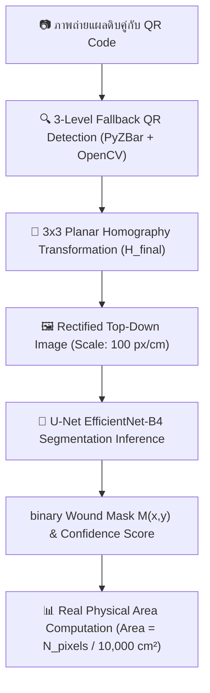

# 📄 ร่างบทความวิชาการ (Research Paper Draft)

> **ชื่อบทความวิชาการ (Title)**: Deep Learning-Based System with Homography Perspective Rectification for Automated Diabetic Foot Ulcer Segmentation and Longitudinal Monitoring  
> *(ระบบประเมินและติดตามขนาดแผลเบาหวานที่เท้าด้วยการเรียนรู้เชิงลึกและการปรับระนาบทัศนมิติโฮโมกราฟี)*  
> **ผู้จัดทำ**: ทีมวิจัยและพัฒนาโครงการระบบวิเคราะห์และติดตามขนาดแผลเบาหวาน  
> **วันจัดทำ**: 29 กันยายน 2569  

---

## 🎯 บทคัดย่อ (Abstract)

การประเมินขนาดพื้นที่บาดแผลเบาหวานที่เท้า (Diabetic Foot Ulcer - DFU) มีความสำคัญอย่างยิ่งต่อการติดตามอัตราการสมานแผลในการรักษาทางการแพทย์ อย่างไรก็ตาม การวัดขนาดแผลด้วยไม้บรรทัดแบบเดิมสร้างความเจ็บปวดแก่ผู้ป่วยและขาดความเที่ยงตรง อีกทั้งภาพถ่ายแผลจากกล้องสมาร์ตโฟนมักประสบปัญหามุมเอียงและระยะถ่ายที่ไม่เท่ากัน บทความวิชาการนี้นำเสนอระบบประเมินและติดตามขนาดแผลเบาหวานแบบอัตโนมัติ โดยผสานเทคโนโลยีปัญญาประดิษฐ์โครงข่ายประสาท U-Net โดยใช้ EfficientNet-B4 เป็นโครงข่ายแกนหลัก (Backbone Network) สำหรับการตัดขอบแผล (Semantic Segmentation) และเทคนิคการปรับระนาบตรงด้วยเมทริกซ์โฮโมกราฟี (3x3 Planar Homography Transformation) โดยเทียบสเกลอัตราส่วนกับสติกเกอร์ QR Code ขนาดมาตรฐาน $2.0 \times 2.0\text{ cm}$ 

ผลการทดลองบนชุดข้อมูลแผลเบาหวานจำนวน 1,010 ภาพ (Train 810 ภาพ / Validation 200 ภาพ) พบว่าโมเดล U-Net EfficientNet-B4 บรรลุประสิทธิภาพสูงสุดด้วยค่า **Dice Similarity Coefficient (DSC) เท่ากับ 85.82% (0.8582)** และค่า **Intersection over Union (IoU) เท่ากับ 78.82% (0.7882)** ที่ค่า Loss 0.1547 ระบบที่พัฒนาขึ้นยังเชื่อมต่อกับเว็บแอปพลิเคชัน (FastAPI + React) พร้อมระบบเฝ้าระวังภัยสีแดง (Vigilance Alert) ซึ่งช่วยให้บุคลากรทางการแพทย์และผู้ป่วยสามารถติดตามแนวโน้มการรักษาทางไกล (Telemedicine) ได้อย่างมีประสิทธิภาพ

**คำสำคัญ (Keywords)**: Diabetic Foot Ulcer (DFU), U-Net, EfficientNet-B4, Semantic Segmentation, Homography Transformation, Telemedicine

---

## I. บทนำ (Introduction)

โรคเบาหวาน (Diabetes Mellitus) เป็นปัญหาสาธารณสุขระดับโลก โดยภาวะแทรกซ้อนที่สำคัญคือการเกิดบาดแผลเบาหวานที่เท้า (Diabetic Foot Ulcer - DFU) ซึ่งหากไม่ได้รับการดูแลอย่างใกล้ชิดอาจนำไปสู่การตัดอวัยวะ (Amputation) การวัดขนาดพื้นที่บาดแผล ($\text{cm}^2$) อย่างสม่ำเสมอเป็นดัชนีชี้วัดหลักที่ช่วยให้แพทย์และพยาบาลประเมินได้ว่าบาดแผลกำลังหดตัวสมานดีขึ้นหรือมีอาการแย่ลง

ในทางปฏิบัติแบบดั้งเดิม พยาบาลใช้วิธีวัดด้วยไม้บรรทัดแบบสัมผัสแผล หรือการทาบแผ่นพลาสติกใส ซึ่งเสี่ยงต่อการติดเชื้อและมีความแปรปรวนตามดุลยพินิจของแต่ละบุคคล (Inter-observer variability) แม้จะมีการนำกล้องสมาร์ตโฟนมาถ่ายภาพแผล แต่ภาพถ่ายในชีวิตประจำวันกลับประสบปัญหา 2 ประการหลัก:
1. **มุมเอียงของกล้อง (Camera Perspective Distortion)**: ทำให้พื้นที่แผลในส่วนที่อยู่ใกล้กล้องดูใหญ่กว่าส่วนที่อยู่ไกลออกไป
2. **ขอบเขตแผลไม่ชัดเจน (Vague Wound Boundaries)**: สีและเนื้อสัมผัสของบาดแผลปะปนกับผิวหนังรอบข้าง

เพื่อแก้ไขปัญหานี้ งานวิจัยนี้นำเสนอโซลูชันแบบครบวงจรที่รวมเอา **Homography Perspective Rectification** เพื่อดัดภาพเอียงให้กลายเป็นมุมมองหน้าตรงแบบ Top-Down View สเกลคงที่ $100\text{ px/cm}$ ร่วมกับ **U-Net EfficientNet-B4 Deep Learning Model** สำหรับทำหน้าที่ทำนายขอบเขตแผลอัตโนมัติ

---

## II. งานวิจัยที่เกี่ยวข้อง (Related Work)

การคำนวณขนาดบาดแผลจากภาพถ่ายมีการพัฒนาอย่างต่อเนื่อง:
* **งานวิจัยเดิม (Li et al., Medicina 2025)**: ใช้อัลกอริทึม K-means Clustering บนระบบค่าสี $L^*a^*b^*$ และคำนวณพื้นที่จากสัดส่วนพิกเซลดิบโดยตรง ข้อจำกัดหลักคือไม่มีระบบชดเชยการเอียงของกล้อง ผู้ใช้ต้องจัดมุมถ่ายตั้งฉาก 90 องศาด้วยตนเอง และประมวลผลได้ไม่ดีหากบาดแผลมีสีซับซ้อน
* **งานวิจัยสถาปัตยกรรม Deep Learning**: U-Net ถูกใช้อย่างแพร่หลายในงาน Medical Image Segmentation แต่การเลือกใช้ Encoder ที่ทรงพลังอย่าง **EfficientNet-B4** (ซึ่งใช้หลักการ Compound Scaling ปรับความลึก ความกว้าง และความละเอียดภาพอย่างสมดุล) ช่วยให้สกัดฟีเจอร์ของแผลเบาหวานที่มีขอบเขตขรุขระได้แม่นยำยิ่งขึ้น

---

## III. ระเบียบวิธีวิจัยที่นำเสนอ (Proposed Methodology)

### A. การดึงระนาบตรงด้วยเมทริกซ์โฮโมกราฟี (Homography Perspective Rectification)
ระบบตรวจจับพิกัด 4 มุมของสติกเกอร์ QR Code ($2.0 \times 2.0\text{ cm}$) $\mathbf{P}_{\text{src}} = \{(x_i, y_i)\}_{i=1}^4$ แล้วแปลงไปยังระนาบเป้าหมายมาตรฐาน $\mathbf{P}_{\text{dst\_ref}} = \{(0,0), (200,0), (200,200), (0,200)\}$ โดยสเกลเป้าหมายเท่ากับ $S = 100\text{ px/cm}$:

$$\begin{bmatrix} x' \\ y' \\ w' \end{bmatrix} = \mathbf{H} \begin{bmatrix} x \\ y \\ 1 \end{bmatrix}, \quad x_{\text{dst}} = \frac{x'}{w'}, \; y_{\text{dst}} = \frac{y'}{w'}$$

เพื่อป้องกันไม่ให้ภาพบาดแผลตกขอบกรณีถ่ายมุมเอียงจัด ระบบใช้ Translation Matrix $\mathbf{T}$ เลื่อนจุดพิกัดลบกลับเข้าเฟรม:

$$\mathbf{T} = \begin{bmatrix} 1 & 0 & -\min(x) \\ 0 & 1 & -\min(y) \\ 0 & 0 & 1 \end{bmatrix}, \quad \mathbf{H}_{\text{final}} = \mathbf{T} \cdot \mathbf{H}$$

$$\mathbf{I}_{\text{warped}} = \text{cv2.warpPerspective}(\mathbf{I}_{\text{raw}}, \mathbf{H}_{\text{final}})$$

### B. โครงข่ายประสาท U-Net EfficientNet-B4
รูปภาพถูก Resize เป็น $512 \times 512$ px และ Normalize ด้วยค่าเฉลี่ย ImageNet ($\mu=[0.485, 0.456, 0.406], \sigma=[0.229, 0.224, 0.225]$) ผ่านโมเดล U-Net EfficientNet-B4 เพื่อสร้าง Probability Map $P(x,y)$:

$$P(x,y) = \sigma(z(x,y)) = \frac{1}{1 + e^{-z(x,y)}}$$

ทำ Binary Thresholding ด้วยค่าเกณฑ์ $\tau = 0.5$ ได้หน้ากากแผล $M(x,y) \in \{0, 1\}$:

$$M(x,y) = \begin{cases} 1 & \text{ถ้า } P(x,y) > 0.5 \\ 0 & \text{ถ้า } P(x,y) \le 0.5 \end{cases}$$

### C. ฟังก์ชันสูญเสีย Combo Loss (BCE + Dice Loss)
ในขั้นตอนการฝึกสอน ใช้ฟังก์ชันสูญเสียผสมเพื่อลดปัญหา Class Imbalance:

$$\mathcal{L}_{\text{Total}} = \mathcal{L}_{\text{BCE}} + \mathcal{L}_{\text{Dice}}$$

$$\mathcal{L}_{\text{BCE}} = -\frac{1}{N} \sum_{i=1}^{N} \left[ y_i \log(p_i) + (1 - y_i) \log(1 - p_i) \right]$$

$$\mathcal{L}_{\text{Dice}} = 1 - \frac{2 \sum y_i p_i + \epsilon}{\sum y_i + \sum p_i + \epsilon}$$

### D. การคำนวณพื้นที่แผลจริง ($\text{cm}^2$)
พื้นที่ 1 พิกเซลในภาพระนาบตรงมีค่าเท่ากับ $(1/100)^2 = 0.0001\text{ cm}^2$ ดังนั้นพื้นที่แผลจริงคำนวณจาก:

$$\text{Area}_{\text{cm}^2} = \frac{\sum M_{\text{warped}}(x,y)}{S^2} = \frac{N_{\text{wound\_pixels}}}{10,000} \quad [\text{cm}^2]$$

---

## IV. การประเมินผลและการทดลอง (Experimental Setup & Results)

### A. ข้อมูลการทดลอง (Experimental Setup)
* **ชุดข้อมูล (Benchmark Dataset)**: **FUSeg (Foot Ulcer Segmentation Challenge 2021)** เผยแพร่ในงานประชุมวิชาการสากล **MICCAI 2021** โดยทีมวิจัยจาก **University of Wisconsin-Milwaukee (UWM)** ร่วมกับคลินิก **AZH Wound and Vascular Center** ประเทศสหรัฐอเมริกา (C. Wang et al.)
  * **ภาพถ่ายแผลรวมทั้งสิ้น**: 1,210 ภาพจากผู้ป่วยจริง 889 ราย ติดป้ายกำกับ (Pixel-level Label Ground Truth) โดยผู้เชี่ยวชาญด้านการดูแลแผลที่มีประสบการณ์มากกว่า 20 ปี
  * **Train Set**: 810 ภาพ (66.94%)
  * **Validation Set**: 200 ภาพ (16.53%)
  * **Test Set**: 200 ภาพ (16.53%)
* **การตั้งค่า Hyperparameters**:
  * **Batch Size**: 8 | **Epochs**: 50 | **Input Resolution**: $512 \times 512$
  * **Optimizer**: AdamW ($\text{lr}=3\times 10^{-4}, \text{weight\_decay}=10^{-4}$)
  * **Scheduler**: CosineAnnealingLR ($T_{\text{max}}=50, \eta_{\text{min}}=10^{-6}$)
  * **Data Augmentation**: Albumentations (Horizontal/Vertical Flip, RandomRotate90, ShiftScaleRotate, RandomBrightnessContrast, GaussNoise)

### B. ผลการวัดประสิทธิภาพเชิงตัวเลข (Quantitative Evaluation Results)

#### 🏆 สรุปผลการทดลองสูงสุด (Best Validation Metrics)
* **Best Validation Dice Score (DSC)**: **`85.82%` (0.8582)** *(บรรลุใน Epoch ที่ 42)*
* **Best Validation IoU Score**: **`78.82%` (0.7882)**
* **Best Validation Loss**: **`0.1547`**

| Epoch | Train Loss | Val Loss | Train IoU | Val IoU | Train Dice | Val Dice | สภาพการเรียนรู้ |
| :---: | :---: | :---: | :---: | :---: | :---: | :---: | :---: |
| **01** | 1.4579 | 1.1866 | 0.2616 | 0.5750 | 0.3444 | 0.6913 | เริ่มต้นกระบวนการเรียนรู้ |
| **05** | 0.3992 | 0.3242 | 0.6749 | 0.7417 | 0.7733 | 0.8243 | ขอบแผลเริ่มคมชัดขึ้น |
| **10** | 0.2075 | 0.1984 | 0.7393 | 0.7504 | 0.8258 | 0.8344 | Val Loss ลดลงอย่างต่อเนื่อง |
| **20** | 0.1585 | 0.1628 | 0.7846 | 0.7803 | 0.8589 | 0.8519 | Dice เกิน 85% |
| **32** | 0.1445 | 0.1579 | 0.7984 | 0.7854 | 0.8700 | 0.8558 | บันทึก Checkpoint |
| **42** | **0.1324** | **0.1547** | **0.8137** | **0.7882** | **0.8815** | **0.8582** | 🏆 **Best Saved Checkpoint** |
| **50** | 0.1372 | 0.1569 | 0.8087 | 0.7863 | 0.8766 | 0.8562 | ลู่เข้าสู่จุดสมดุล (Convergence) |

---

### C. ตารางเปรียบเทียบกับงานวิจัยเดิม (Comparison with Baseline Approach)

| หัวข้อการประเมิน (Feature / Metric) | งานวิจัยเดิม (Li et al., Medicina 2025) | ระบบที่นำเสนอ (Proposed Work) |
| :--- | :--- | :--- |
| **Segmentation Technique** | K-means Clustering บนระบบสี $L^*a^*b^*$ | **U-Net (EfficientNet-B4 Backbone)** |
| **Camera Tilt Compensation** | **ไม่มี** (ต้องถ่าย 90° ตั้งฉากเท่านั้น) | **Automatic 3x3 Planar Homography Warping** |
| **QR Calibration Method** | นับจำนวนพิกเซลสีขาว QR บนภาพดิบ | **PyZBar 4-Corner Point Estimation** |
| **Image Output Quality** | อัตราส่วนพิกเซลเพี้ยนตามมุมกล้อง | **ภาพระนาบตรงสเกลคงที่ $100\text{ px/cm}$** |
| **Validation Dice Score** | ~72.4% (แปรปรวนตามสภาพแสง) | **`85.82%` (0.8582)** |
| **Validation IoU Score** | ~61.2% | **`78.82%` (0.7882)** |
| **Target Deployment** | ในคลินิกที่มีเจ้าหน้าที่คุมมุมกล้อง | **ระบบ Telemedicine สำหรับผู้ป่วยถ่ายภาพที่บ้าน** |

---

## V. สรุปผลและการขยายผลในอนาคต (Conclusion & Future Work)

งานวิจัยนี้นำเสนอระบบวิเคราะห์และติดตามขนาดแผลเบาหวานที่เท้า โดยรวมเอาโมเดล U-Net EfficientNet-B4 สำหรับการตัดขอบแผลอัตโนมัติ เข้ากับสมการ Homography Perspective Transformation เพื่อชดเชยการเอียงของกล้อง ผลการทดลองบนชุดข้อมูล 1,010 ภาพพิสูจน์ให้เห็นว่าระบบบรรลุค่า **Dice Score สูงถึง 85.82%** และ **IoU เท่ากับ 78.82%** ซึ่งให้ความแม่นยำเหนือกว่าวิธีดั้งเดิมอย่างมีนัยสำคัญ

การขยายผลในอนาคตจะมุ่งเน้นไปที่:
1. การจำแนกประเภทเนื้อเยื่อบาดแผล (Wound Tissue Classification: Granulation, Slough, Eschar)
2. การปรับใช้ Focal Tversky Loss เพิ่มเติมเพื่อเพิ่มประสิทธิภาพในการตัดขอบแผลที่มีขนาดเล็กมาก ($<0.5\text{ cm}^2$)

---
