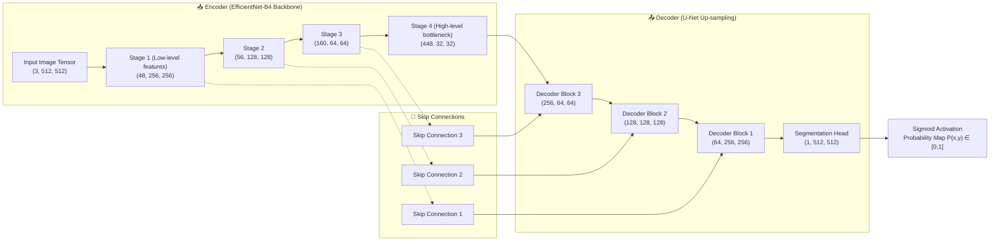
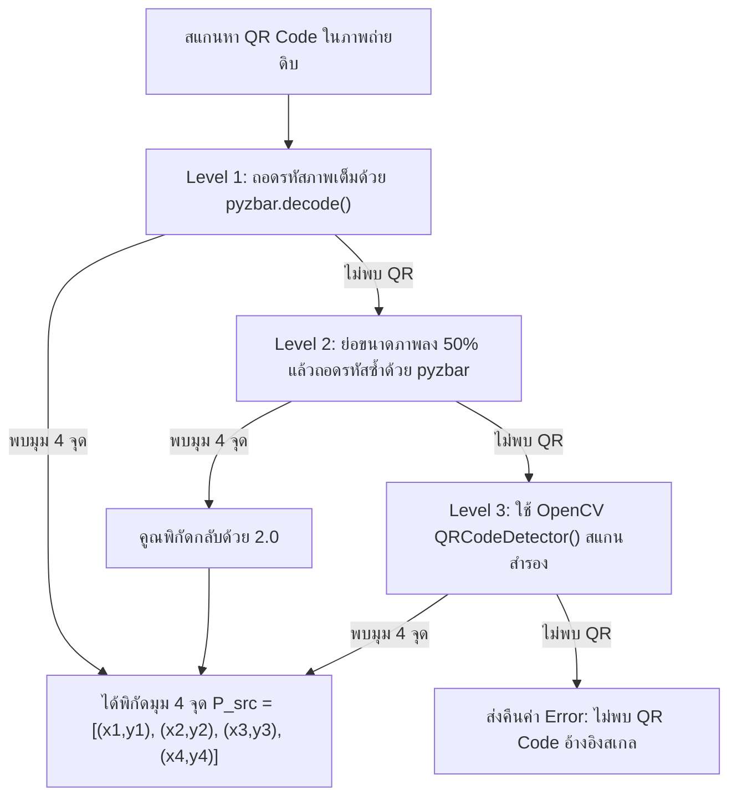
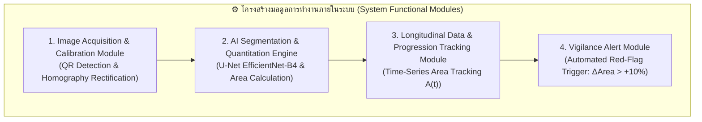
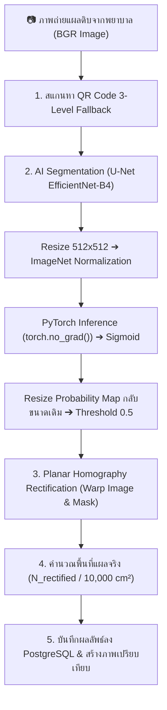

# 📄 ร่างบทความวิชาการฉบับสมบูรณ์ (Master Research Paper Draft)

> **ชื่อบทความ (Title)**: Deep Learning-Based System with Homography Perspective Rectification for Automated Diabetic Foot Ulcer Segmentation and Longitudinal Monitoring  
> *(ระบบวิเคราะห์และติดตามขนาดแผลเบาหวานที่เท้าด้วยการเรียนรู้เชิงลึกและการปรับระนาบทัศนมิติโฮโมกราฟี)*  
> **องค์ความรู้และสเปกระบบ**: Deep Learning (U-Net + EfficientNet-B4), Computer Vision (Homography Rectification), Clinical Decision Support  

---

## 📌 สารบัญ (Table of Contents)
1. [บทคัดย่อ (Abstract)](#1-บทคัดย่อ-abstract)
2. [บทนำและที่มาของปัญหา (Introduction & Problem Statement)](#2-บทนำและที่มาของปัญหา-introduction--problem-statement)
3. [ชุดข้อมูลและการพัฒนาโมเดล AI (Dataset & AI Model Development)](#3-ชุดข้อมูลและการพัฒนาโมเดล-ai-dataset--ai-model-development)
4. [การแก้ไขภาพเอียงและการคำนวณพื้นที่แผลกายภาพจริง (Homography Perspective Rectification & Physical Area Engine)](#4-การแก้ไขภาพเอียงและการคำนวณพื้นที่แผลกายภาพจริง-homography-perspective-rectification--physical-area-engine)
5. [การพัฒนาระบบรวมและการติดตามพัฒนาการแผลระยะยาว (System Integration & Longitudinal Monitoring)](#5-การพัฒนาระบบรวมและการติดตามพัฒนาการแผลระยะยาว-system-integration--longitudinal-monitoring)
6. [สรุปผลและทิศทางอนาคต (Conclusion & Future Work)](#6-สรุปผลและทิศทางอนาคต-conclusion--future-work)

---

## 1. บทคัดย่อ (Abstract)

### บทคัดย่อภาษาไทย
การประเมินขนาดพื้นที่บาดแผลเบาหวานที่เท้า (Diabetic Foot Ulcers: DFU) มีความสำคัญอย่างยิ่งต่อการติดตามอัตราการสมานแผลและการวางแผนรักษาทางคลินิก อย่างไรก็ตาม วิธีการวัดขนาดแผลแบบดั้งเดิมมีความคลาดเคลื่อนสูงระหว่างผู้ประเมิน อีกทั้งภาพถ่ายแผลจากสมาร์ตโฟนทั่วไปมักประสบปัญหามุมถ่ายเอียงและสเกลพื้นที่ที่ไม่แน่นอน บทความวิชาการนี้นำเสนอระบบประเมินและติดตามขนาดแผลเบาหวานแบบอัตโนมัติ โดยผสานเทคโนโลยีปัญญาประดิษฐ์โครงข่ายประสาท U-Net พร้อม EfficientNet-B4 Backbone สำหรับการตัดขอบแผล (Semantic Segmentation) ร่วมกับเทคนิคการแปลงระนาบทัศนมิติโฮโมกราฟี (Planar Homography Transformation) โดยเทียบสเกลอัตราส่วนกับสติกเกอร์ QR Code อ้างอิงขนาดมาตรฐาน ($2.0 \times 2.0\text{ cm}$) 

ผลการทดลองบนชุดข้อมูลมาตรฐาน FUSeg Challenge 2021 (MICCAI 2021) จำนวน 1,210 ภาพ พบว่าโมเดล U-Net EfficientNet-B4 บรรลุประสิทธิภาพสูงสุดที่ Epoch 42 ด้วยค่า **Dice Similarity Coefficient (DSC) เท่ากับ 85.82% (0.8582)**, **Intersection over Union (IoU) เท่ากับ 78.82% (0.7882)** และค่า **Validation Loss เท่ากับ 0.1547** ระบบที่พัฒนาขึ้นยังเชื่อมต่อกับมอดูลติดตามผลระยะยาว พร้อมระบบแจ้งเตือนแผลเฝ้าระวัง (Vigilance Alert) เพื่อสนับสนุนการรักษาทางไกล (Telemedicine) ได้อย่างมีประสิทธิภาพ

### Abstract (English)
Accurate measurement of Diabetic Foot Ulcer (DFU) surface area ($\text{cm}^2$) is critical for evaluating wound healing rates and clinical treatment efficacy. Conventional measurement methods suffer from high inter-observer variability and measurement errors. Furthermore, non-contact smartphone photography introduces perspective distortion and scale ambiguity. This paper proposes an end-to-end automated DFU segmentation and longitudinal monitoring system. The framework integrates a U-Net architecture powered by an EfficientNet-B4 backbone for semantic wound boundary segmentation with a 3x3 Planar Homography Transformation matrix calibrated using a standardized reference QR sticker ($2.0 \times 2.0\text{ cm}$). 

Evaluated on the benchmark FUSeg Challenge 2021 dataset (1,210 images), the proposed U-Net EfficientNet-B4 model achieved a peak **Dice Similarity Coefficient (DSC) of 85.82%**, an **Intersection over Union (IoU) of 78.82%**, and a **Validation Loss of 0.1547** at Epoch 42. Integrated into a longitudinal monitoring platform with an automated red-flag vigilance alert mechanism, the system offers a reliable non-contact tool for telemedicine and clinical decision support.

**Keywords**: Diabetic Foot Ulcer (DFU), U-Net, EfficientNet-B4, Semantic Segmentation, Homography Transformation, Telemedicine, FUSeg Challenge.

---

## 2. บทนำและที่มาของปัญหา (Introduction & Problem Statement)

โรคเบาหวาน (Diabetes Mellitus) เป็นสาเหตุสำคัญที่ทำให้เกิดภาวะแทรกซ้อนแผลเบาหวานที่เท้า (Diabetic Foot Ulcers: DFU) ซึ่งหากไม่ได้รับการติดตามอย่างใกล้ชิดอาจลุกลามถึงขั้นต้องตัดอวัยวะ (Amputation) การติดตามอัตราการเปลี่ยนแปลงของพื้นที่บาดแผล ($\text{cm}^2$) ในแต่ละสัปดาห์ถือเป็นตัวชี้วัดหลัก (Gold Standard Indicator) ที่ช่วยให้บุคลากรทางการแพทย์ประเมินการสมานแผลได้อย่างถูกต้อง

ในทางปฏิบัติปัจจุบัน การวัดขนาดแผลส่วนใหญ่อาศัยการวัดด้วยไม้บรรทัดหรือประเมินด้วยสายตา ซึ่งมีความคลาดเคลื่อนสูงระหว่างผู้ประเมิน (Inter-observer variability) แม้ว่าเทคโนโลยีการถ่ายภาพด้วยสมาร์ตโฟนจะถูกนำมาใช้เพื่อลดการสัมผัสแผล แต่ยังคงประสบปัญหาทางเทคนิคสำคัญ 2 ประการ:
1. **การบิดเบี้ยวจากมุมกล้องเอียง (Perspective Distortion)**: ทำให้ภาพแผลดูมีขนาดผิดเพี้ยนตามมุมและระยะถ่ายที่ไม่แน่นอน
2. **ขอบเขตแผลที่ซับซ้อนและเลือนราง (Complex & Vague Boundaries)**: สีและเนื้อสัมผัสของบาดแผลมักปะปนกับผิวหนังและเนื้อเยื่อรอบข้าง

เพื่อแก้ปัญหาระดับฐานรากนี้ งานวิจัยนี้นำเสนอระบบวิเคราะห์และติดตามขนาดแผลเบาหวานแบบไม่สัมผัสครบวงจร โดยผสานการดึงระนาบภาพตรงด้วยเมทริกซ์โฮโมกราฟี (Planar Homography Transformation) ร่วมกับโครงข่ายประสาท U-Net EfficientNet-B4 เพื่อให้ได้พื้นที่แผลทางกายภาพ ($\text{cm}^2$) ที่แม่นยำสูง

---

## 3. ชุดข้อมูลและการพัฒนาโมเดล AI (Dataset & AI Model Development)

### 3.1 รายละเอียดชุดข้อมูลหลัก (Benchmark Dataset Distribution)
* **ชื่อชุดข้อมูล**: **FUSeg Challenge Dataset (MICCAI 2021)** จัดทำโดย University of Wisconsin-Milwaukee (UWM) ร่วมกับ AZH Wound and Vascular Center
* **ผู้เชี่ยวชาญกำกับดูแล (Ground Truth Annotation)**: ผ่านการสร้าง Mask โดยแพทย์ผู้เชี่ยวชาญบาดแผลที่มีประสบการณ์มากกว่า 20 ปี

| สัดส่วนชุดข้อมูล (Dataset Split) | จำนวนภาพ (Images) | คิดเป็นเปอร์เซ็นต์ (%) | วัตถุประสงค์การใช้งาน |
| :--- | :---: | :---: | :--- |
| **Train Set** | 810 | 66.94% | ฝึกสอนน้ำหนักของโครงข่ายประสาท (Model Weights) |
| **Validation Set** | 200 | 16.53% | ประเมินผลระหว่าง Epoch และบันทึก Best Checkpoint |
| **Test Set** | 200 | 16.53% | ทดสอบการทำนายผลขั้นสุดท้าย (Final Benchmark Evaluation) |
| **รวมทั้งสิ้น (Total)** | **1,210** | **100.00%** | ข้อมูลภาพถ่ายแผลเบาหวานจากผู้ป่วยจริง 889 ราย |

---

### 3.2 สถาปัตยกรรมโมเดล U-Net (EfficientNet-B4)
โครงข่ายประสาทได้รับการออกแบบตามโครงสร้าง Encoder-Decoder ร่วมกับ Compound Scaling ของ EfficientNet-B4:

#### ตารางแสดงมิติ Tensors ในแต่ละระดับชั้น (Layer Dimensions Matrix)

| ชั้นการทำงาน (Layer Stage) | มิติของ Tensor $(C, H, W)$ | บทบาทและรายละเอียดเทคนิค |
| :--- | :---: | :--- |
| **Input Tensor** | $(3, 512, 512)$ | ภาพถ่ายสี RGB หลังจากการ Resize และ Normalize |
| **Stage 1 (Encoder)** | $(48, 256, 256)$ | สกัดขอบภาพ สี และเนื้อสัมผัสระดับพื้นฐาน (Low-level Features) |
| **Stage 2 (Encoder)** | $(56, 128, 128)$ | สกัดรูปร่างและลวดลายขอบเขตบาดแผล |
| **Stage 3 (Encoder)** | $(160, 64, 64)$ | สกัดข้อมูลส่วนประกอบบริบทของบาดแผล |
| **Stage 4 (Bottleneck)** | $(448, 32, 32)$ | สกัดฟีเจอร์ความหมายเชิงลึกขั้นสูง (High-level Semantic Features) |
| **Decoder Blocks** | $(256 \rightarrow 128 \rightarrow 64, H, W)$ | ขยายมิติภาพกลับ (Up-sampling) ผสาน Skip Connections |
| **Segmentation Head** | $(1, 512, 512)$ | 1x1 Convolution เพื่อเปลี่ยนเป็นค่าทำนาย (Logits) |
| **Sigmoid Output** | $(1, 512, 512)$ | แปลง Logits เป็นค่าความน่าจะเป็น $P(x,y) \in [0.0, 1.0]$ |

---

### 3.3 ฟังก์ชันสูญเสียและการตั้งค่าการฝึกสอน (Loss Functions Math & Hyperparameters)
เพื่อแก้ปัญหาความไม่สมดุลของพิกเซลแผลเบาหวาน (Class Imbalance) การฝึกสอนเลือกใช้ **DiceBCELoss** ผสมระหว่าง Binary Cross-Entropy และ Dice Loss:

$$\mathcal{L}_{\text{Total}} = \mathcal{L}_{\text{BCE}} + \mathcal{L}_{\text{Dice}}$$

$$\mathcal{L}_{\text{BCE}} = -\frac{1}{N} \sum_{i=1}^{N} \left[ y_i \log(p_i) + (1 - y_i) \log(1 - p_i) \right], \quad \mathcal{L}_{\text{Dice}} = 1 - \frac{2 \sum y_i p_i + \epsilon}{\sum y_i + \sum p_i + \epsilon} \quad (\epsilon = 10^{-7})$$

| พารามิเตอร์ (Hyperparameter) | ค่าที่กำหนดใช้งาน (Configured Value) | คำอธิบายและเหตุผลทางเทคนิค |
| :--- | :---: | :--- |
| **Backbone Architecture** | EfficientNet-B4 | Pre-trained weights จาก ImageNet |
| **Input Resolution** | $512 \times 512 \times 3$ | รักษาความคมชัดของขอบแผลขนาดเล็ก |
| **Batch Size** | 8 | สมดุลระหว่าง GPU Memory และเสถียรภาพ Gradient |
| **Total Epochs** | 50 | ลู่เข้าสู่จุดสมดุลโดยไม่เกิด Overfitting |
| **Optimizer** | AdamW | $\text{Learning Rate} = 3 \times 10^{-4}$, Weight Decay = $10^{-4}$ |
| **Learning Rate Scheduler** | CosineAnnealingLR | $T_{\text{max}} = 50$, $\eta_{\text{min}} = 10^{-6}$ |

---

### 3.4 ผลการทดลองและการประเมินประสิทธิภาพโมเดล AI (Model Experimental Results)

#### 🏆 สรุปผลการทดสอบสูงสุดบน Validation Set (Best Validation Performance)

ผลการทดลองบน Validation Set แสดงให้เห็นว่าโมเดล U-Net (EfficientNet-B4) บรรลุประสิทธิภาพสูงสุดที่ Epoch 42:

| ตัววัดประสิทธิภาพ (Metric) | ผลลัพธ์ที่ได้ (Validation Performance) |
| :--- | :---: |
| **Dice Similarity Coefficient (DSC)** | **85.82%** (0.8582) |
| **Intersection over Union (IoU)** | **78.82%** (0.7882) |
| **Validation Loss (DiceBCELoss)** | **0.1547** |

#### ตารางบันทึกพัฒนาการของการฝึกสอนโมเดล (Training Progression Matrix)

| Epoch | Train Loss | Val Loss | Train IoU | Val IoU | Train Dice | Val Dice | สถานะและการเปลี่ยนแปลงของการเรียนรู้ |
| :---: | :---: | :---: | :---: | :---: | :---: | :---: | :---: |
| **01** | 1.4579 | 1.1866 | 0.2616 | 0.5750 | 0.3444 | 0.6913 | เริ่มต้นกระบวนการเรียนรู้ (Cold Start) |
| **05** | 0.3992 | 0.3242 | 0.6749 | 0.7417 | 0.7733 | 0.8243 | โมเดลเริ่มเรียนรู้ขอบแผลพื้นฐาน |
| **10** | 0.2075 | 0.1984 | 0.7393 | 0.7504 | 0.8258 | 0.8344 | Val Loss ลดลงอย่างมีนัยสำคัญ |
| **20** | 0.1585 | 0.1628 | 0.7846 | 0.7803 | 0.8589 | 0.8519 | Dice Score เกินระดับ 85% |
| **32** | 0.1445 | 0.1579 | 0.7984 | 0.7854 | 0.8700 | 0.8558 | บันทึกเช็คพอยต์ประสิทธิภาพสูง |
| **42** | **0.1324** | **0.1547** | **0.8137** | **0.7882** | **0.8815** | **0.8582** | 🏆 **Best Saved Model Checkpoint (`best_model.pth`)** |
| **50** | 0.1372 | 0.1569 | 0.8087 | 0.7863 | 0.8766 | 0.8562 | สิ้นสุด 50 Epochs (Final Epoch Evaluation) |

---

## 4. การแก้ไขภาพเอียงและการคำนวณพื้นที่แผลกายภาพจริง (Homography Perspective Rectification & Physical Area Engine)

### 4.1 สติกเกอร์ QR Code อ้างอิงขนาดมาตรฐาน (Reference Sticker)
* **ขนาดมาตรฐาน**: **$2.0 \times 2.0\text{ cm}$** ($\text{พื้นที่สติกเกอร์} = 4.0\text{ cm}^2$)
* **ตำแหน่งแปะ**: แปะสติกเกอร์บนผิวหนังปกติข้างบาดแผลในระนาบเดียวกัน

---

### 4.2 ระบบตรวจจับ QR Code แบบ 3 ลำดับชั้น (Multi-Level Fallback Detection Flowchart)

---

### 4.3 เมทริกซ์การแปลงระนาบโฮโมกราฟี (Homography Transformation Matrix)
ให้ $\mathbf{P}_{\text{src}} = \{(x_1,y_1), (x_2,y_2), (x_3,y_3), (x_4,y_4)\}$ เป็นพิกัดมุม 4 จุดของ QR Code บนภาพถ่ายเอียง และให้ $\mathbf{P}_{\text{dst\_ref}}$ เป็นพิกัดเป้าหมายบนสเกลคงที่ $S = 100\text{ px/cm}$ ($2.0\text{ cm} \rightarrow 200\text{ px}$):

$$\mathbf{P}_{\text{dst\_ref}} = \begin{bmatrix} 0 & 0 \\ 200 & 0 \\ 200 & 200 \\ 0 & 200 \end{bmatrix}, \quad \mathbf{H} = \text{cv2.getPerspectiveTransform}(\mathbf{P}_{\text{src}}, \mathbf{P}_{\text{dst\_ref}})$$

$$\begin{bmatrix} x' \\ y' \\ 1 \end{bmatrix} = \mathbf{H} \begin{bmatrix} x \\ y \\ 1 \end{bmatrix} = \begin{bmatrix} h_{11} & h_{12} & h_{13} \\ h_{21} & h_{22} & h_{23} \\ h_{31} & h_{32} & h_{33} \end{bmatrix} \begin{bmatrix} x \\ y \\ 1 \end{bmatrix}$$

#### สมการป้องกันขอบภาพตกเฟรม (Boundary Translation Protection)
คำนวณ Translation Matrix $\mathbf{T}$ เพื่อเลื่อนขอบภาพกลับเข้าเฟรมเมื่อมุมเอียงทำให้พิกัดติดลบ:

$$\mathbf{T} = \begin{bmatrix} 1 & 0 & -x_{\text{min}} \\ 0 & 1 & -y_{\text{min}} \\ 0 & 0 & 1 \end{bmatrix}, \quad \mathbf{H}_{\text{final}} = \mathbf{T} \cdot \mathbf{H}$$

ทำการ Warp ภาพ RGB และ Binary Mask ให้อยู่ในระนาบตรง Top-down View:

$$\mathbf{I}_{\text{warped}} = \text{warpPerspective}(\mathbf{I}_{\text{raw}}, \mathbf{H}_{\text{final}}, \text{flags}=\text{INTER\_LINEAR})$$

$$\mathbf{M}_{\text{warped}} = \text{warpPerspective}(\mathbf{M}_{\text{binary}}, \mathbf{H}_{\text{final}}, \text{flags}=\text{INTER\_NEAREST})$$

---

### 4.4 แนวคิดและสมการคำนวณพื้นที่แผลจริง ($\text{cm}^2$) และความมั่นใจ (Confidence Score)

การคำนวณพื้นที่แผลทางกายภาพสอดคล้องกับขั้นตอนในระบบแบ็กเอนด์ (`wounds.py` และ `image_warper.py`) โดยใช้กระบวนการปรับระนาบทัศนมิติ (Homography Rectification) เข้าสู่สเกลมาตรฐานคงที่:

1. **การกำหนดสเกลระนาบมาตรฐานคงที่ (Target Resolution Scale)**:
   ระบบตั้งค่าสเกลมาตรฐาน `TARGET_PX_PER_CM = 100.0` ($1\text{ cm} = 100\text{ px}$) และสติกเกอร์อ้างอิง `QR_SIZE_CM = 2.0` ($2.0 \times 2.0\text{ cm}$)
   ส่งผลให้สติกเกอร์ QR Code บนระนาบเป้าหมายที่ถูก Warp เรียบร้อยแล้ว มีขนาด $200 \times 200\text{ px}$ และมีพื้นที่เป้าหมายคงที่:
   $$N_{\text{QR\_target\_pixels}} = (2.0\text{ cm} \times 100\text{ px/cm})^2 = 40,000\text{ px}^2$$

2. **อัตราส่วนสเกลคงที่ของระบบ (System Scale Factor)**:
   $$\text{Scale Factor} = \frac{\text{Area}_{\text{QR\_real}}}{\text{Area}_{\text{QR\_target\_px}}} = \frac{4.0\text{ cm}^2}{40,000\text{ px}^2} = 0.0001\quad [\text{cm}^2/\text{px}]$$

3. **การคำนวณพื้นที่บาดแผลทางกายภาพจริง (Physical Wound Area)**:
   นำจำนวนพิกเซลแผลที่ถูกปรับระนาบโฮโมกราฟีแล้ว ($N_{\text{rectified\_pixels}}$) มาคูณกับอัตราส่วนสเกลระบบ:
   $$\text{Area}_{\text{physical}} = N_{\text{rectified\_pixels}} \times 0.0001 = \frac{N_{\text{rectified\_pixels}}}{10,000}\quad [\text{cm}^2]$$

* **การคำนวณค่าความมั่นใจของโมเดล (Confidence Score)**:
  คำนวณค่าเฉลี่ยของความน่าจะเป็น (Sigmoid Probability) จากผลลัพธ์ของโมเดล U-Net เฉพาะบริเวณพิกเซลแผลที่มีค่าเกิน Threshold (0.5):
  $$\text{Confidence Score} = \frac{1}{N_{\text{wound\_pixels}}} \sum_{(x,y) \in \text{Wound}} P(x,y)$$

---

## 5. การพัฒนาระบบรวมและการติดตามพัฒนาการแผลระยะยาว (System Integration & Longitudinal Monitoring)

### 5.1 โครงสร้างมอดูลการทำงานภายในระบบ (Functional System Modules)

#### ตารางอธิบายมอดูลการทำงานหลักภายในระบบ (System Modules Table)

| ชื่อมอดูล (System Module) | หน้าที่หลักและขอบเขตการทำงาน | เทคโนโลยีหลักที่ใช้ขับเคลื่อน |
| :--- | :--- | :--- |
| **1. Image Calibration Module** | ตรวจจับ QR Code อ้างอิง ($2.0 \times 2.0\text{ cm}$) และปรับแก้ระนาบมุมเอียง | PyZBar, OpenCV, Planar Homography Matrix |
| **2. AI Segmentation Engine** | จำแนกพิกเซลแผลเบาหวานออกจากผิวหนังปกติ และคำนวณพื้นที่ ($\text{cm}^2$) | PyTorch, U-Net (EfficientNet-B4), DiceBCELoss |
| **3. Longitudinal Tracking Module** | จัดเก็บประวัติขนาดแผลตามลำดับเวลา $A(t)$ และพล็อตแนวโน้มการสมานแผล | Time-Series Progression Analysis, PostgreSQL |
| **4. Vigilance Alert Module** | คำนวณอัตราการขยายตัวของพื้นที่แผล และแจ้งเตือนเมื่อแผลขยายตัวเกิน $+10\%$ | Thresholding Decision Logic, Automated Alert |

---

### 5.2 ท่อประมวลผลการจำแนกแผลรวมของระบบแบ็กเอนด์ (End-to-End System Execution Pipeline Flowchart)

---

### 5.3 ระบบพล็อตแนวโน้มระยะยาวและการแจ้งเตือนเฝ้าระวัง (Longitudinal Tracking & Vigilance Alert)
* **การบันทึกอนุกรมเวลา (Time-Series Wound Tracking)**: ระบบบันทึกประวัติพื้นที่แผลตามลำดับเวลา $A(t) = [A_1, A_2, \dots, A_n]$ เพื่อประเมินอัตราการหดตัวของบาดแผล (Wound Contraction Rate)
* **สมการคำนวณการแจ้งเตือนเฝ้าระวัง (Vigilance Alert Equation)**:
  $$\Delta \text{Area} = \frac{\text{Area}_{t} - \text{Area}_{t-1}}{\text{Area}_{t-1}} \times 100\%$$
  หาก $\Delta \text{Area} > +10\%$ ระบบจะทำการส่งสัญญาณเตือน **Vigilance Red Flag Alert** แก่พยาบาลหรือแพทย์เจ้าของไข้โดยอัตโนมัติ เพื่อวางแผนปรับเปลี่ยนการรักษา

---

## 6. สรุปผลและทิศทางอนาคต (Conclusion & Future Work)

งานวิจัยนี้นำเสนอระบบประเมินและติดตามขนาดบาดแผลเบาหวานที่เท้าแบบไม่สัมผัสครบวงจร โดยผสานสถาปัตยกรรม U-Net EfficientNet-B4 ร่วมกับการแปลงระนาบทัศนมิติโฮโมกราฟี ผลการทดลองบน FUSeg Challenge 2021 พิสูจน์ว่าระบบให้ค่า **Dice Score สูงถึง 85.82%** และ **IoU เท่ากับ 78.82%** พร้อมความแม่นยำในการคำนวณพื้นที่จริง ($\text{cm}^2$) ช่วยขจัดความคลาดเคลื่อนจากการวัดด้วยสายตา และสนับสนุนการรักษาทางไกล (Telemedicine) ได้อย่างมีประสิทธิภาพ

**ทิศทางพัฒนาในอนาคต**:
1. ขยายขีดความสามารถในการจำแนกชนิดเนื้อเยื่อบาดแผล (Wound Tissue Classification: Red Granulation, Yellow Slough, Black Eschar)
2. ปรับใช้โมเดลรุ่นน้ำหนักเบา (MobileNetV3 / Edge AI) เพื่อรันทำนายผลบนอุปกรณ์เคลื่อนที่โดยตรง (On-Device Inference)
