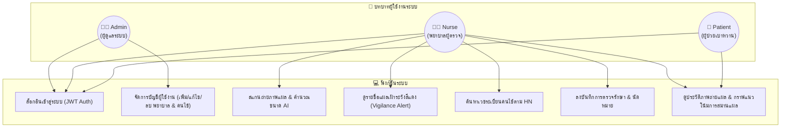
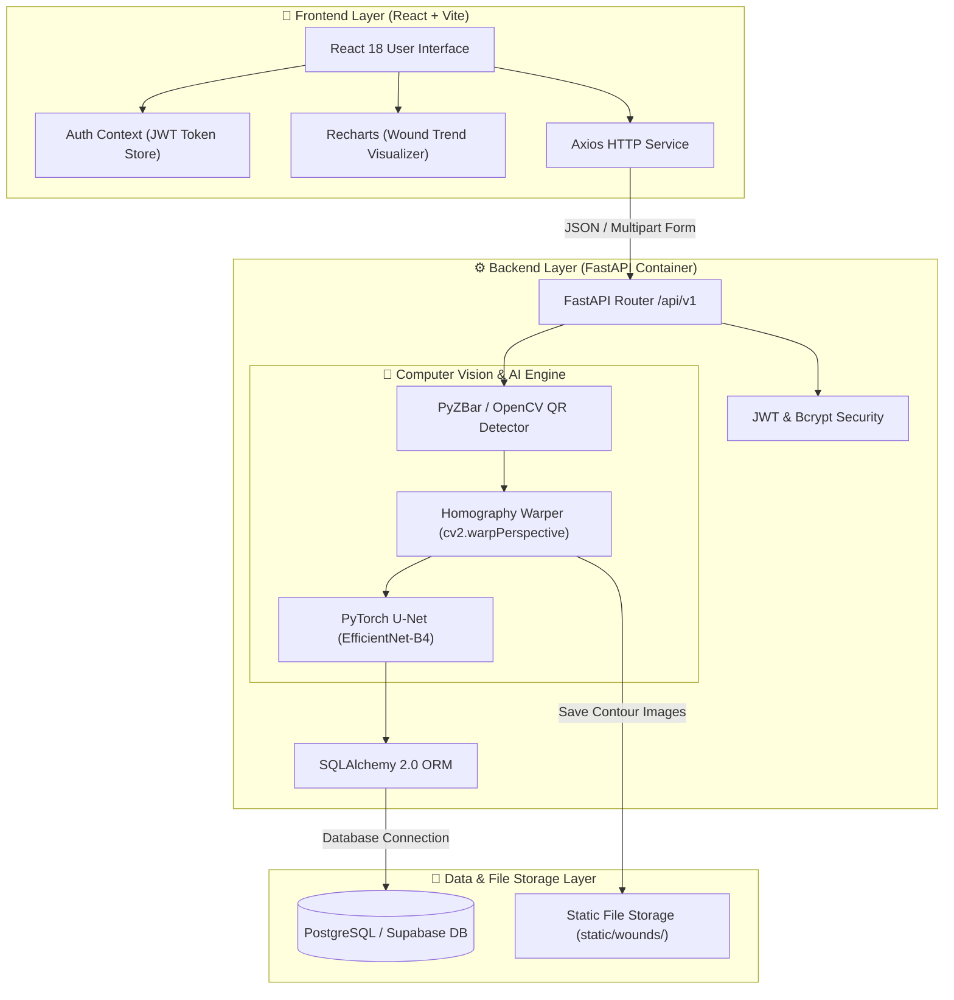
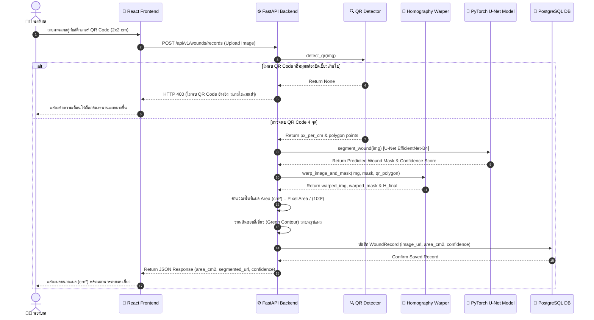
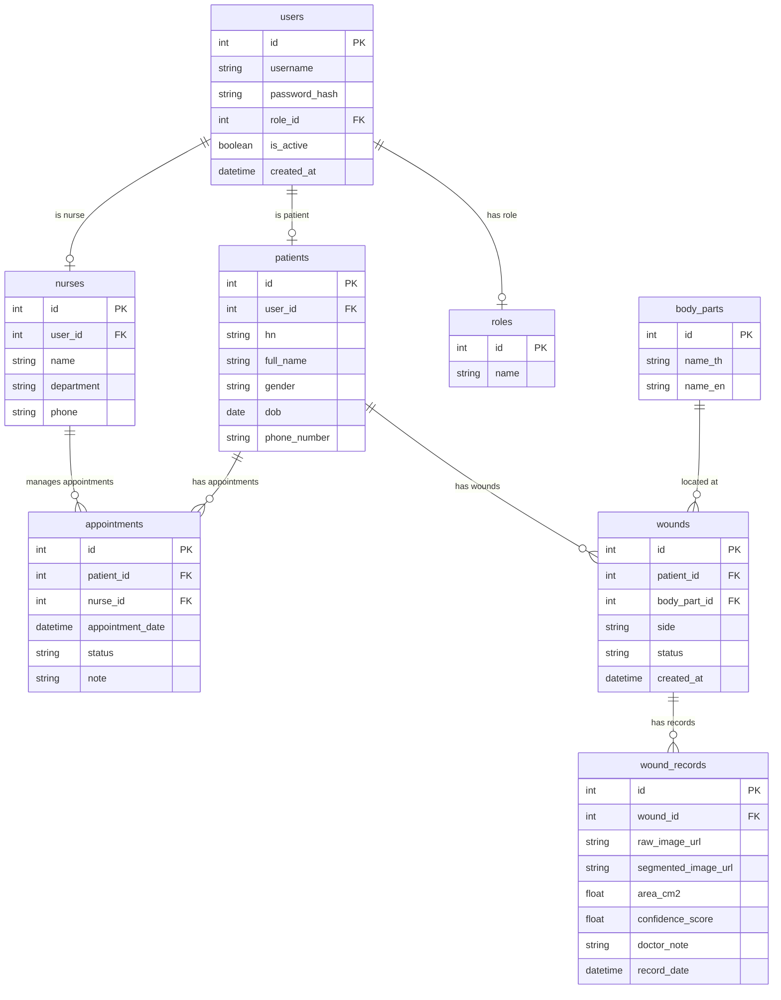

# 📘 เอกสารสถาปัตยกรรมระบบและระเบียบวิธีวิจัยทางเทคนิค (System Architecture & Technical Specification)

> **โครงการ**: ระบบวิเคราะห์และติดตามขนาดแผลเบาหวานที่เท้าด้วยการเรียนรู้เชิงลึก  
> *(Deep Learning-Based System for Segmentation and Monitoring of Diabetic Foot Ulcers)*  
> **สร้างเมื่อ**: 29 กันยายน 2569 (2026-09-29)  
> **สถานะเอกสาร**: Draft & Workspace Discussion Note  

---

## 📌 สารบัญ (Table of Contents)
1. [ภาพรวมและขอบเขตของระบบ (System Overview)](#1-ภาพรวมและขอบเขตของระบบ-system-overview)
2. [สิทธิและบทบาทผู้ใช้งาน (Use Case Diagram)](#2-สิทธิและบทบาทผู้ใช้งาน-use-case-diagram)
3. [สถาปัตยกรรมเชิงเทคโนโลยี (System Architecture Diagram)](#3-สถาปัตยกรรมเชิงเทคโนโลยี-system-architecture-diagram)
4. [ลำดับขั้นตอนการประมวลผลรูปภาพ (Data Flow & Sequence Diagram)](#4-ลำดับขั้นตอนการประมวลผลรูปภาพ-data-flow--sequence-diagram)
5. [ผังความสัมพันธ์ตารางฐานข้อมูล (Entity-Relationship Diagram)](#5-ผังความสัมพันธ์ตารางฐานข้อมูล-entity-relationship-diagram)
6. [ระเบียบวิธีทางคณิตศาสตร์และ Computer Vision Engine](#6-ระเบียบวิธีทางคณิตศาสตร์และ-computer-vision-engine)
7. [พื้นที่บันทึกการหารือและปรับปรุง (Discussion & Note Space)](#7-พื้นที่บันทึกการหารือและปรับปรุง-discussion--note-space)

---

## 1. ภาพรวมและขอบเขตของระบบ (System Overview)

ระบบเว็บแอปพลิเคชันสำหรับประเมินและติดตามแนวโน้มการรักษาแผลเบาหวานที่เท้า (Diabetic Foot Ulcer - DFU) เพื่อช่วยพยาบาลและบุคลากรทางการแพทย์ในการวัดขนาดพื้นที่บาดแผล ($cm^2$) ได้อย่างแม่นยำจากภาพถ่ายกล้องสมาร์ตโฟน โดยผสานเทคโนโลยี Computer Vision และ Deep Learning:

* **Homography Perspective Transformation**: แก้ไขปัญหากล้องเอียงและระยะถ่ายเอียง โดยเทียบสเกลกับกระดาษ QR Code มาตรฐาน ($2\text{ cm} \times 2\text{ cm} = 4\text{ cm}^2$)
* **U-Net EfficientNet-B4 Segmentation**: ตัดขอบแผลเบาหวานอัตโนมัติความแม่นยำสูง
* **Vigilance Alert System**: ตรวจจับแผลที่มีขนาดขยายใหญ่ขึ้นเพื่อการเฝ้าระวังทางคลินิก
* **Patient & Nurse Portal**: ติดตามประวัติแผลย้อนหลัง พล็อตกราฟแนวโน้ม และจัดการนัดหมาย

---

## 2. สิทธิและบทบาทผู้ใช้งาน (Use Case Diagram)

---

## 3. สถาปัตยกรรมเชิงเทคโนโลยี (System Architecture Diagram)

---

## 4. ลำดับขั้นตอนการประมวลผลรูปภาพ (Data Flow & Sequence Diagram)

---

## 5. ผังความสัมพันธ์ตารางฐานข้อมูล (Entity-Relationship Diagram)

---

## 6. ระเบียบวิธีทางคณิตศาสตร์และ Computer Vision Engine

### 6.1 การดึงระนาบภาพถ่ายด้วยเมทริกซ์โฮโมกราฟี (Homography Transformation)
การถ่ายภาพด้วยกล้องมือถือมักมีมุมเอียงและความสูงที่ไม่เท่ากัน ระบบจึงใช้จุดพิกัด 4 มุมของ QR Code สติกเกอร์อ้างอิง $\mathbf{P}_{\text{src}} = \{(x_i, y_i)\}_{i=1}^4$ แปลงไปยังพิกัดเป้าหมายสมมติ $\mathbf{P}_{\text{dst}} = \{(x'_i, y'_i)\}_{i=1}^4$ โดยที่กำหนดสเกลเป้าหมายคงที่ $1\text{ cm} = 100\text{ pixels}$ ($S = 100\text{ px/cm}$):

$$\begin{bmatrix} x' \\ y' \\ w' \end{bmatrix} = \mathbf{H} \begin{bmatrix} x \\ y \\ 1 \end{bmatrix} = \begin{bmatrix} h_{11} & h_{12} & h_{13} \\ h_{21} & h_{22} & h_{23} \\ h_{31} & h_{32} & 1 \end{bmatrix} \begin{bmatrix} x \\ y \\ 1 \end{bmatrix}$$

โดยที่พิกัดระนาบตรง (Rectified Top-Down Coordinates) เท่ากับ:
$$x_{\text{dst}} = \frac{x'}{w'} = \frac{h_{11}x + h_{12}y + h_{13}}{h_{31}x + h_{32}y + 1}, \quad y_{\text{dst}} = \frac{y'}{w'} = \frac{h_{21}x + h_{22}y + h_{23}}{h_{31}x + h_{32}y + 1}$$

---

### 6.2 การคำนวณพื้นที่พิกเซล QR Code จากสูตร Shoelace (Gauss's Area Formula)
ในการตรวจสอบขนาดพิกเซลของสติกเกอร์ QR Code บนภาพถ่ายดิบ จะใช้สมการ Shoelace คำนวณพื้นที่ตามแนวเส้นขอบ 4 จุด:

$$A_{\text{QR\_px}} = \frac{1}{2} \left| (x_1 y_2 + x_2 y_3 + x_3 y_4 + x_4 y_1) - (y_1 x_2 + y_2 x_3 + y_3 x_4 + y_4 x_1) \right|$$

---

### 6.3 โครงข่ายประสาท U-Net (EfficientNet-B4) Semantic Segmentation
รูปภาพจะถูก Resize เป็น $512 \times 512$ px และเข้ากระบวนการ Normalization ด้วยค่าเฉลี่ย ImageNet:

$$\mathbf{I}_{\text{norm}} = \frac{\mathbf{I} - \mu}{\sigma}, \quad \mu = [0.485, 0.456, 0.406], \;\sigma = [0.229, 0.224, 0.225]$$

ผ่านโมเดล U-Net เพื่อสร้าง Probability Map $P(x,y) \in [0, 1]$ ด้วยฟังก์ชัน Sigmoid:

$$P(x,y) = \sigma(z(x,y)) = \frac{1}{1 + e^{-z(x,y)}}$$

ขยายขนาด Probability Map กลับสู่ขนาดภาพดั้งเดิมด้วยการประมาณค่าเชิงเส้นตรง ($cv2.INTER\_LINEAR$) แล้วทำ Binary Thresholding ด้วยเกณฑ์ $\tau = 0.5$:

$$M(x,y) = \begin{cases} 1 & \text{ถ้า } P(x,y) > \tau \\ 0 & \text{ถ้า } P(x,y) \le \tau \end{cases}$$

---

### 6.4 การคำนวณพื้นที่แผลจริงทางกายภาพ ($\text{cm}^2$)
เมื่อภาพแผลและภาพ Binary Mask ถูกดึงระนาบด้วยเมทริกซ์โฮโมกราฟี $\mathbf{H}_{\text{final}}$ เรียบร้อยแล้ว พื้นที่ 1 พิกเซลในภาพระนาบตรงจะมีค่าสเกลคงที่เท่ากับ:

$$\text{Pixel Area Scale} = \left(\frac{1}{S}\right)^2 = \left(\frac{1}{100 \text{ px/cm}}\right)^2 = 0.0001 \text{ cm}^2/\text{pixel}$$

ดังนั้น พื้นที่แผลเบาหวานจริง ($\text{Area}_{\text{cm}^2}$) คำนวณได้จาก:

$$\text{Area}_{\text{cm}^2} = \frac{\sum_{(x,y)} M_{\text{warped}}(x,y)}{S^2} = \frac{N_{\text{wound\_pixels}}}{10,000}$$

---

## 7. พื้นที่บันทึกการหารือและปรับปรุง (Discussion & Note Space)

> *ส่วนนี้ใช้สำหรับจดบันทึกความคิดเห็น ข้อเสนอแนะ และการแก้ไขเอกสารร่วมกัน*

* **[2026-09-29 20:00]**: สร้างไฟล์เอกสารตั้งต้นพร้อมผัง Mermaid ทั้ง 4 แบบ และสูตรคณิตศาสตร์ทาง CV/AI
* **[ข้อเสนอแนะถัดไป]**: 
  - [ ] เพิ่มคำอธิบายการประเมินค่า Confidence Score
  - [ ] ขัดเกลาภาษาเชิงวิชาการสำหรับรายงานโครงงานปี 4
  - [ ] ตรวจสอบความสอดคล้องกับเล่มข้อเสนอโครงงาน

---
