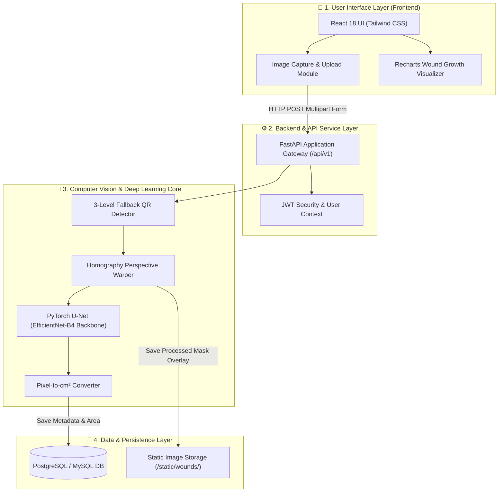
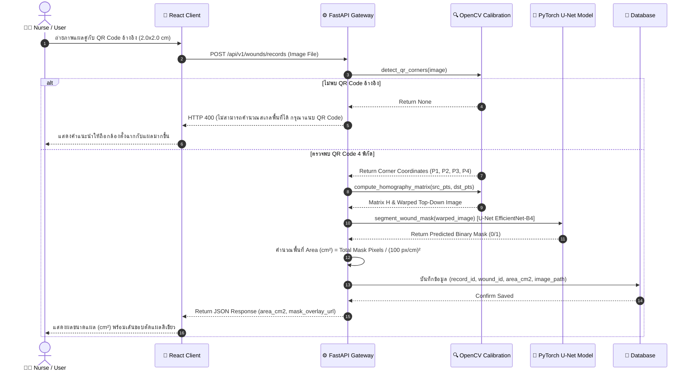

# 📘 เอกสารสถาปัตยกรรมระบบ ข้อมูลชุดฝึกสอน และผลการทดลองวิจัย
> **โครงการ**: ระบบวิเคราะห์และติดตามขนาดแผลเบาหวานที่เท้าด้วยการเรียนรู้เชิงลึก  
> *(Deep Learning-Based System for Segmentation and Monitoring of Diabetic Foot Ulcers)*  
> **วัตถุประสงค์**: รวบรวมข้อมูลสถาปัตยกรรมระบบ (System Architecture), ชุดข้อมูล (Dataset), การตั้งค่าการเทรน (Training Setup), และผลการทดลองจริง (Experimental Results) สำหรับประกอบรูปเล่มรายงานวิจัยและ Paper วิชาการ  

---

## 📌 สารบัญ (Table of Contents)
1. [สถาปัตยกรรมระบบภาพรวม (End-to-End System Architecture)](#1-สถาปัตยกรรมระบบภาพรวม-end-to-end-system-architecture)
2. [ลำดับขั้นตอนการประมวลผลข้อมูล (Core Data Flow Sequence Pipeline)](#2-ลำดับขั้นตอนการประมวลผลข้อมูล-core-data-flow-sequence-pipeline)
3. [ที่มาของชุดข้อมูลและการฝึกสอนโมเดล (Dataset & Training Methodology)](#3-ที่มาของชุดข้อมูลและการฝึกสอนโมเดล-dataset--training-methodology)
4. [ผลการทดลองและการวัดผลเชิงประจักษ์ (Empirical Experimental Results)](#4-ผลการทดลองและการวัดผลเชิงประจักษ์-empirical-experimental-results)
5. [ระเบียบวิธีทางคณิตศาสตร์ (Core Mathematics Engine)](#5-ระเบียบวิธีทางคณิตศาสตร์-core-mathematics-engine)

---

## 1. สถาปัตยกรรมระบบภาพรวม (End-to-End System Architecture)

ระบบประกอบด้วย 4 ส่วนการทำงานหลักที่เชื่อมต่อกันแบบ RESTful API เพื่อความยืดหยุ่นในการประมวลผลและการขยายระบบ:

---

## 2. ลำดับขั้นตอนการประมวลผลข้อมูล (Core Data Flow Sequence Pipeline)

ลำดับการทำงานตั้งแต่ผู้ใช้ส่งภาพถ่ายแผลคู่กับสติกเกอร์ QR Code จนถึงการได้มาซึ่งขนาดแผลทางกายภาพ ($\text{cm}^2$):

---

## 3. ที่มาของชุดข้อมูลและการฝึกสอนโมเดล (Dataset & Training Methodology)

### 3.1 ชุดข้อมูลภาพแผลเบาหวาน (Dataset Description)
* **ชุดข้อมูลหลัก**: **FUSeg Challenge Dataset (MICCAI 2021)** จัดทำโดย UWM และ AZH Wound and Vascular Center
* **จำนวนภาพทั้งหมด**: **1,210 ภาพ** พร้อมภาพเฉลย Binary Mask ขอบเขตแผล (Ground Truth)
* **การแบ่งสัดส่วนชุดข้อมูล (Dataset Split)**:
  * **Training Set**: 810 ภาพ (สำหรับฝึกสอนโมเดล)
  * **Validation Set**: 200 ภาพ (สำหรับปรับแต่ง Hyperparameters และประเมินระหว่างเทรน)
  * **Test Set**: 200 ภาพ (สำหรับวัดผลการทดสอบขั้นสุดท้าย)

### 3.2 กระบวนการเตรียมและเพิ่มขยายข้อมูล (Data Augmentation & Preprocessing)
* **การปรับขนาดภาพ**: Resize เป็นขนาด $512 \times 512$ พิกเซล
* **Normalization**: ปรับสเกลค่าพิกเซลด้วย Mean และ Standard Deviation ของ ImageNet:
  $$\mu = [0.485, 0.456, 0.406], \quad \sigma = [0.229, 0.224, 0.225]$$
* **Data Augmentation Technique**:
  * Random Rotation ($\pm 15^\circ$)
  * Horizontal Flip (ความน่าจะเป็น 50%)
  * Color Jitter (Brightness & Contrast Adjustment)
  * ShiftScaleRotate Transformation

### 3.3 สถาปัตยกรรมโมเดลและการตั้งค่าพารามิเตอร์ (Model Architecture & Hyperparameters)
* **Model Architecture**: **U-Net Architecture**
* **Backbone Encoder**: **EfficientNet-B4** (Pre-trained weights จาก ImageNet)
* **Loss Function**: **DiceBCELoss** (ผสมผสานระหว่าง Binary Cross-Entropy Loss และ Dice Loss):
  $$\mathcal{L}_{\text{DiceBCE}} = \mathcal{L}_{\text{BCE}} + \mathcal{L}_{\text{Dice}}$$
* **Optimizer**: **AdamW** ($\text{Learning Rate} = 3 \times 10^{-4}$, Weight Decay = $1 \times 10^{-4}$)
* **Learning Rate Scheduler**: **CosineAnnealingLR**
* **Batch Size**: 8
* **Epochs**: 50 Epochs

---

## 4. ผลการทดลองและการวัดผลเชิงประจักษ์ (Empirical Experimental Results)

### 4.1 ประสิทธิภาพโมเดลบน Validation Set (Best Model at Epoch 42)
จากการทดลองฝึกสอนบน Kaggle GPU Environment โมเดลบรรลุประสิทธิภาพสูงสุดที่ Epoch 42 โดยมีผลลัพธ์ดังนี้:

| ตัววัดประสิทธิภาพ (Evaluation Metric) | ค่าที่ได้จริง (Empirical Result) |
| :--- | :---: |
| **Dice Similarity Coefficient (DSC)** | **85.82%** |
| **Intersection over Union (IoU / Jaccard Index)** | **78.82%** |
| **Validation Loss ($\mathcal{L}_{\text{DiceBCE}}$)** | **0.1547** |

---

### 4.2 สมการตัววัดประสิทธิภาพ (Evaluation Metric Equations)

1. **Dice Similarity Coefficient (DSC)**:
   $$DSC = \frac{2 \times |X \cap Y|}{|X| + |Y|} = \frac{2 \cdot TP}{2 \cdot TP + FP + FN}$$

2. **Intersection over Union (IoU)**:
   $$IoU = \frac{|X \cap Y|}{|X \cup Y|} = \frac{TP}{TP + FP + FN}$$

*(โดยที่ $X$ คือพื้นที่ Ground Truth, $Y$ คือพื้นที่การพยากรณ์ของโมเดล, $TP$ คือ True Positive, $FP$ คือ False Positive, $FN$ คือ False Negative)*

---

## 5. ระเบียบวิธีทางคณิตศาสตร์ (Core Mathematics Engine)

### 5.1 การดึงระนาบภาพด้วยเมทริกซ์โฮโมกราฟี (Homography Perspective Transformation)
ความสัมพันธ์ระหว่างพิกเซลภาพถ่ายเอียง $\mathbf{P}_{\text{src}} = (x, y, 1)^T$ และพิกเซลระนาบตรง Top-down $\mathbf{P}_{\text{dst}} = (x', y', 1)^T$ คำนวณผ่าน Homography Matrix $\mathbf{H} \in \mathbb{R}^{3 \times 3}$:

$$\begin{bmatrix} x' \\ y' \\ 1 \end{bmatrix} = \mathbf{H} \begin{bmatrix} x \\ y \\ 1 \end{bmatrix} = \begin{bmatrix} h_{11} & h_{12} & h_{13} \\ h_{21} & h_{22} & h_{23} \\ h_{31} & h_{32} & 1 \end{bmatrix} \begin{bmatrix} x \\ y \\ 1 \end{bmatrix}$$

---

### 5.2 การคำนวณพื้นที่แผลเป็นตารางเซนติเมตร ($\text{cm}^2$)
เมื่อดึงระนาบภาพถ่ายให้อยู่ในมุมมองตรง Top-down โดยตั้งค่าสเกลเป้าหมายเท่ากับ $100\text{ pixels} = 1\text{ cm}$ ($S = 100\text{ px/cm}$):

$$\text{Pixel Area Scale} = \left(\frac{1}{S}\right)^2 = \left(\frac{1}{100\text{ px/cm}}\right)^2 = 0.0001 \text{ cm}^2/\text{pixel}$$

พื้นที่บาดแผลทางกายภาพจริง ($\text{Area}_{\text{cm}^2}$) เท่ากับ:

$$\text{Area}_{\text{cm}^2} = \frac{\sum_{(x,y)} M(x,y)}{S^2} = \frac{N_{\text{wound\_pixels}}}{10,000}$$

*(โดยที่ $M(x,y) \in \{0, 1\}$ คือค่าใน Binary Mask ของแผลที่ผ่านการพยากรณ์จากโมเดล U-Net)*
